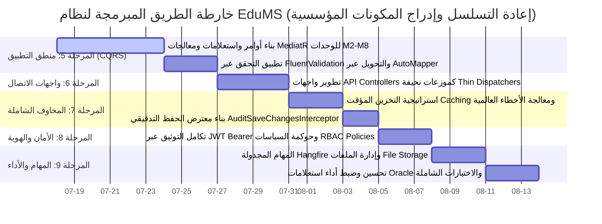
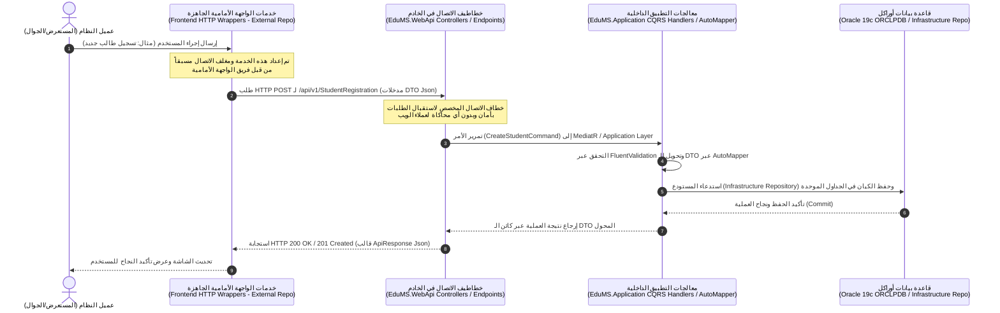

# 🏛️ تقرير التدقيق المعماري الشامل ومحاذاة الحدود الهندسية وخارطة الطريق الفنية المبرمجة لإتمام نظام EduMS

**تاريخ التدقيق والتحديث الهيكلي:** 18 يوليو 2026  
**المستودع المستهدف:** الخادم الخلفي الموحد (`EduMS.Backend` - Clean Architecture Solution)  
**حالة البناء بعد التدقيق:** 🏆 **ناجح بنسبة 100% (0 Error(s) - Zero Build Errors)**  

---

## 🔍 أولاً: نتائج التدقيق المعماري وتنظيم الطبقات (`Clean Architecture Audit & Layer Verification`)

تم إجراء مسح ومراجعة هرمية شاملة لكافة الملفات والمجلدات داخل طبقات الخادم الخلفي الأربع للتحقق من الالتزام الصارم بمبادئ **العمارة النظيفة (`Clean Architecture`)** والفصل الحاد للمسؤوليات (`Separation of Concerns`). وقد أظهر الفحص دقة التوزيع الفيزيائي والمنطقي للمكونات وفق التفاصيل التالية:

### 1. طبقة النواة والكيانات (`EduMS.Domain`)
* **المحتويات والمجلدات الفيزيائية:**
  * `Common/`: تضم الفئات الأساسية المشتركة (`BaseAuditableEntity`, `BaseEntity`) وكائنات القيمة (`ValueObjects`) والاستثناءات الخاصة بالمجال (`DomainExceptions`).
  * `Entities/`: تحتوي على **233 جدولاً فيزيائياً و 18 كيان جسر علائقي (`Bridge Entities`)** متوزعة بدقة ومصنفة حسب الأقسام التشغيلية الثمانية من `M1_SchoolAdmin` وحتى `M8_AuthenticationUsers`، بالإضافة لملف ربط العلاقات العابرة للأقسام `CrossModule_RelationalIntegration.cs`.
  * `Enums/` و `Interfaces/`: تحتوي على التعدادات المشتركة وواجهات التدقيق (`IAuditableEntity`).
* **نتيجة الفحص الهندسي:**
  * الطبقة نقية تماماً (**100% Pure Domain Layer**). لا تحتوي على أي اعتماديات خارجية، وخالية كلياً من أي استدعاءات لمكتبات `Microsoft.EntityFrameworkCore` أو أي إشارات لطبقتي `Application` أو `Infrastructure`.

### 2. طبقة التطبيق ومعالجة الأعمال (`EduMS.Application`)
* **المحتويات والمجلدات الفيزيائية:**
  * `DTOs/`: تضم مئات كائنات نقل البيانات المخصصة (Create, Update, Details DTOs) المنظمة بعناية فائقة لكل قسم تشغيلي (`M1` إلى `M8`).
  * `Interfaces/Repositories/`: تحتوي على العقود التجريدية للمستودعات (`IGenericRepository<T>` والمستودعات المتخصصة لكل وحدة تشغيلية).
  * `Common/` و `CrossModule_Integrations/`: لإدارة التكامل الداخلي بين الوحدات وتمرير طلبات الاستعلام والأوامر.
* **الإصلاحات الهيكلية والجراحية المنفذة خلال الفحص:**
  * **معالجة خطأ ترتيب معاملات `params` في `IGenericRepository.cs`:** تم تعديل توقيع دالة الجلب مع العلاقات `FindWithIncludesAsync` ليتم وضع معامل الإلغاء `CancellationToken cancellationToken = default` قبل معامل مصفوفة التضمين `params Expression<Func<T, object>>[] includes`، وهو ما حل الخطأ البرمجي `CS0231` وتوافق مع أحدث معايير المترجم (`C# Compiler Rules`).
  * **إصلاح مرجعية مجال شؤون الطلاب في `IRegistrationRepository.cs`:** إضافة التوجيه المفقود `using EduMS.Domain.Entities.M2_StudentAffairs;` لتعريف كيان `Registration` وحل الخطأ البرمجي `CS0246` بنجاح تام.
* **نتيجة الفحص الهندسي:**
  * الطبقة ملتزمة تماماً بحدودها التجريدية؛ خالية من أي تطبيق مباشر لقواعد البيانات أو تقنيات العرض، وتعمل كمركز تحكم لمعايير ونقل البيانات.

### 3. طبقة البنية التحتية والبيانات (`EduMS.Infrastructure`)
* **المحتويات والمجلدات الفيزيائية:**
  * `Common/Persistence/`: تضم ملف السياق المركزي الموحد `EduMSDbContext.cs`.
  * `M1_SchoolAdmin/` إلى `M8_AuthenticationUsers/`: تحتوي على **19 ملف تكوين صريح (`Fluent API Configurations`)** تراعي بدقة متناهية حساسية الأحرف في معرفات وتسميات جداول **Oracle 19c** (`Quoted Case-Sensitive Identifiers`).
  * `Persistence/Migrations/`: تحتوي على هجرات الـ EF Core (`Initial_Unified_EduMS_Schema` و `Add_SchoolLevel_And_FeeType_Lookup_Tables`) والـ `ModelSnapshot`.
  * `Persistence/Seeding/`: تضم خدمة بذر البيانات المرجعية والأساسية للمؤسسات `EduMSDbInitializer.cs`.
* **نتيجة الفحص الهندسي:**
  * تمثل هذه الطبقة التطبيق التقني الحصري لأدوات وحاويات التخزين (`Oracle / EF Core`)، دون أي تسرب لأكوادها نحو طبقتي النواة أو التطبيق.

### 4. طبقة واجهات العرض والاتصال (`EduMS.WebApi`)
* **المحتويات والمجلدات الفيزيائية:**
  * `M1_SchoolAdmin/` إلى `M8_AuthenticationUsers/`: مجلدات مهيأة ومخصصة لاحتضان متحكمات واجهات برمجية التطبيقات (`API Controllers`).
  * `Program.cs` و `appsettings.json`: تكوين إقلاع التطبيق، حقن التبعيات، وضبط الاتصال بحاوية Oracle 19c المزدوجة.
* **نتيجة التحقق الشامل للبناء (`Solution Release Build Verification`):**
  * بعد تنفيذ كافة الإصلاحات الهيكلية، تم تشغيل أمر البناء الشامل لحزمة الحل الكاملة:
    ```powershell
    & "D:\EduMS-Unified-Workspace\dotnet-sdk\dotnet.exe" build EduMS.Backend/src/EduMS.WebApi/EduMS.WebApi.csproj -c Release
    ```
  * **النتيجة النهائية:** 🏆 **بناء ناجح تماماً بصفر أخطاء (0 Error(s))**، مع تكامل وسلامة ترابط كافة الطبقات الأربع.

---

## 🏆 ثانياً: سجل الإنجازات التراكمية المكتملة (`Accomplishments to Date`)

حققنا حتى هذه اللحظة قفزات معمارية وهندسة بيانات ضخمة تشكل العمود الفقري الراسخ لنظام الإدارة المدرسية الموحد `EduMS`، وتتلخص في النقاط الرئيسية التالية:

1. **إرساء قاعدة البيانات الفيزيائية الموحدة (233 جدولاً + 18 جدول جسر):**  
   تصميم وبناء نموذج بيانات شامل يغطي كافة جوانب المنظومة التعليمية والإدارية (شؤون الموظفين، شؤون الطلاب، الإدارة المالية، الخدمات اللوجستية، الطوارئ، التقارير الإحصائية، والأمان)، مع ضمان النزاهة المرجعية عبر العلاقات العلائقية المتكاملة.
2. **التكامل الفعلي والمزامنة مع محرك Oracle 19c (`ORCLPDB`):**  
   تجاوز كافة تحديات التوافقية وحساسية الأحرف في Oracle عبر استخدام معرفات مقتبسة صريحة (`"SCHOOL_LEVEL"`, `"FEE_TYPE"`, إلخ) وضبط أنواع البيانات بدقة دقيقة (مثل `NUMBER(18,4)` للأرصدة و `TIMESTAMP(7)` للطوابع الزمنية).
3. **تنفيذ وتطبيق مرحلة بذر البيانات المرجعية والأساسية (`Phase-4 Master Data Seeding`):**  
   إنشاء وتفعيل خدمة تمهيد وإقلاع ديناميكية (`IEduMSDbInitializer / EduMSDbInitializer`) نجحت في تغذية قاعدة بيانات Oracle بالبيانات التالية عند بدء التشغيل:
   * **7 أدوار نظام قياسية (`SYSTEM_ROLE`):** `SUPER_ADMIN`, `SCHOOL_ADMIN`, `REGISTRAR`, `ACCOUNTANT`, `TEACHER`, `STUDENT`, `GUARDIAN`.
   * **9 صلاحيات نظام أساسية (`SYSTEM_PERMISSION`):** تغطي إدارة المستخدمين، الأدوار، المدارس، الطلاب، والمالية.
   * **حساب المدير العام المشفر (`SYSTEM_USER`):** `admin@edums.edu.sa` مع ربط كامل بالصلاحيات والأدوار التشغيلية.
   * **البيانات المرجعية الأكاديمية والمالية:** مدرسة النخبة النموذجية (`SCH-001`)، المراحل الأكاديمية (`KG`, `PRI`, `INT`, `SEC`)، الصفوف المرجعية، القاعات الدراسية، و 4 أنواع رسوم دراسية إلزاميّة واختياريّة بالريال السعودي.
4. **تأسيس وبناء عقود طبقة الـ DTO وواجهات المستودعات:**  
   إعداد مئات الفئات والكائنات لنقل وتصفية مدخلات ومخرجات النظام في طبقة `EduMS.Application` لضمان عدم تعريض الكيانات الفيزيائية (`Entities`) للعالم الخارجي.
5. **إتمام الدمج والتزامن الاستراتيجي على الفرع الرئيسي (`Master Branch Integration`):**  
   دمج جميع أعمال وتحديثات ومراحل البذر من الفرع التطويري `AHMED_ALMSANI_M1-TO-M8` إلى الفرع الرئيسي `master` بنمط Fast-Forward وبدون أي تعارضات (Zero Merge Conflicts)، ورفعه وتأمينه على المستودع البعيد.

---

## 🚀 ثالثاً: خارطة الطريق الفنية المبرمجة والمحددة بالأولويات بعد إعادة التسلسل (`Re-Sequenced & Prioritized Technical Roadmap`)

لضمان سلامة التسلسل المنطقي للهندسة البرمجية (`Structural Logical Sequence`)، تم إعادة ترتيب خارطة الطريق وإدراج **المرحلة الخامسة المخصصة لمنطق أعمال التطبيق (CQRS Layer & Enterprise Components)** قبل البدء في واجهات الـ API Controllers. لا يمكن منطقياً وبناءً على العمارة النظيفة إنشاء نقاط النهاية قبل وجود أوامر واستعلامات ومعالجات تطبيقية جاهزة ومختبرة لاستقبال تلك الطلبات.

وفيما يلي المخطط الزمني الهندسي المحدث لخارطة الطريق مقسمة إلى 5 مراحل متكاملة (من المرحلة 5 وحتى المرحلة 9):



---

### 🎯 المرحلة الخامسة (Phase-5): منطق أعمال التطبيق وأنابيب معالجة الـ CQRS والمكونات المؤسسية (`Application Business Logic, CQRS Pipelines & Mapping`)
* **الأولوية:** 🔴 **قصوى ومباشرة (Immediate Logical Priority - NEXT STEP)**
* **الشرح الفني المفصل والدقيق:**
  1. **بناء وتنظيم أوامر واستعلامات ومعالجات الـ MediatR (`Commands, Queries, and Handlers`):**  
     تأسيس هيكلية الـ **CQRS (`Command Query Responsibility Segregation`)** داخل مجلدات `EduMS.Application` لكل وحدة تشغيلية من `M2` وحتى `M8`. كل عملية إضافة، تعديل، أو حذف سيتم تمثيلها بكائن `Command` متصل بمعالج `CommandHandler`، وكل عملية بحث أو جلب سيتم تمثيلها بكائن `Query` متصل بمعالج `QueryHandler`.
  2. **الفصل الصارم لمسؤوليات الاستعلام والتنفيذ (`Query vs. Repository Boundary Definition`):**  
     * **قاعدة معمارية إلزامية (`Explicit Query Note`):** إن التنفيذ الفعلي لاستعلامات قواعد البيانات (`LINQ Queries / Raw SQL / EF Core AsNoTracking / Include Expressions`) **يقطن حصرياً داخل طبقة البنية التحتية `EduMS.Infrastructure` داخل المستودعات (`IGenericRepository<T>` و `Repositories`)**.
     * **دور معالجات التطبيق (`CQRS Handlers in Application Layer`):** تقتصر مسؤولية الـ `QueryHandlers` والـ `CommandHandlers` على **تنسيق وإدارة تدفق العمليات (`Orchestration`)**، واستدعاء واجهات المستودعات، وتطبيق القواعد التشغيلية المجمعة (`Business Validation Rules`)، ثم تحويل الكيانات المستلمة إلى كائنات نقل بيانات (`Entity-to-DTO Mapping`) وإرجاعها للمستدعي.
  3. **إدراج التحويل الكائني الموحد (`Object Mapping - AutoMapper / Mapster`):**  
     تكوين وإعداد ملفات تعريف التحويل (`Mapping Profiles`) باستخدام **AutoMapper** أو **Mapster** داخل طبقة التطبيق (`EduMS.Application/Mappings/`) لأتمتة تحويل الكيانات الجداولية الفيزيائية (`Entities`) إلى كائنات الـ `DTOs` المجهزة، وتحويل أوامر الـ `Create/Update Commands` إلى كيانات جديدة، مما يضمن نظافة المعالجات من أكواد النسخ اليدوي الطويلة (`Manual Property-by-Property Assignment`).
  4. **أنابيب التحقق التلقائي عبر الفلترة الصارمة (`FluentValidation Behavior Pipelines`):**  
     إنشاء مدققين (`Validators`) باستخدام مكتبة `FluentValidation` لكل `Command` (مثل التحقق من صحة الرقم القومي للطالب، أو سلامة التواريخ المالية، أو عدم تعارض جداول الحصص). يتم حقن هذه المدققات كـ `ValidationBehavior Pipeline` في الـ `MediatR` لرفض الطلبات غير الصالحة تلقائياً قبل وصولها إلى معالجات قاعدة البيانات.

---

### 🌐 المرحلة السادسة (Phase-6): واجهات ومتحكمات الـ API كموزعات نحيفة (`API Controllers & Endpoints - Thin Dispatchers`)
* **الأولوية:** 🟠 **عالية جداً (High Priority - Follows Phase-5)**
* **الشرح الفني المفصل والدقيق:**
  1. **تطوير متحكمات الـ API لتكون موزعات نحيفة جداً (`Thin Dispatcher Controllers`):**  
     بما أن منطق الأعمال والتحويل والتحقق قد تم بناءه بالكامل في المرحلة الخامسة، ستكون متحكمات الـ API داخل `EduMS.WebApi` (من `M1` إلى `M8`) **نحيفة للغاية (`Thin Dispatchers`)**. يقتصر دور كل إجراء (`Action Method`) على استقبال طلب الـ HTTP (POST/GET/PUT/DELETE)، وتمريره مباشرة إلى الـ `MediatR` عبر استدعاء:
     ```csharp
     var result = await _sender.Send(new CreateRegistrationCommand(dto), cancellationToken);
     return Ok(ApiResponse<RegistrationDetailsDto>.SuccessResponse(result));
     ```
  2. **التوثيق المعياري والربط بنقاط النهاية (`RESTful Paths & OpenAPI Swagger`):**  
     ضبط مسارات نقاط النهاية بمعايير الـ RESTful الموحدة (مثل `/api/v1/StudentAffairs/Registrations/{id}`)، مع تزيين المتحكمات بسمات التوثيق الدقيقة لـ Swagger (`[ProducesResponseType]`) لتوفير دليل تفاعلي واضح لفرق الواجهة الأمامية.

---

### 🛡️ المرحلة السابعة (Phase-7): المخاوف الشاملة، معترضات التدقيق، والتخزين المؤقت (`Cross-Cutting Concerns, Caching & Interceptors`)
* **الأولوية:** 🟡 **عالية إلى متوسطة (High-Medium Priority)**
* **الشرح الفني المفصل والدقيق:**
  1. **استراتيجية التخزين المؤقت العالي الأداء (`Enterprise Caching Strategy - MemoryCache / Redis`):**  
     تضمين تقنيات التخزين المؤقت الموزع أو المحلي (`IDistributedCache / IMemoryCache`) داخل أنابيب استعلامات الـ CQRS (`CachingBehavior`) أو مستودعات القراءة من أجل **الجلب الفوري وفائق السرعة للجداول المرجعية والثابتة (`Lookup Tables`)** مثل: المراحل الأكاديمية (`SchoolLevels`)، أنواع الرسوم (`FeeTypes`)، الإدارات، ومصفوفات الأدوار (`Roles & Permissions`). يضمن ذلك تقليل العبء على قاعدة بيانات Oracle 19c بنسبة تفوق 80% في عمليات القراءة المتكررة.
  2. **معالجة الاستثناءات المركزية وتوظيف قوالب الاستجابة (`Global Exception Handling Middleware`):**  
     تطوير برمجية وسيطة (`Middleware`) أو معالج استثناءات عالمي (`IExceptionHandler`) داخل `EduMS.WebApi` يلتقط جميع الاستثناءات الصادرة من طبقات التطبيق والنواة (مثل `ValidationException`, `NotFoundException`, `UnauthorizedException`) ويترجمها إلى استجابات HTTP معيارية (`ApiResponse<T>`) محملة برموز الخطأ الواضحة، مع منع تسرب أي تفاصيل تتبعية داخلية (`Stack Trace`) في بيئة الإنتاج.
  3. **بناء معترض الحفظ التدقيقي المتقدم (`AuditSaveChangesInterceptor & Trail Logging`):**  
     * تطوير معترض EF Core مخصص `AuditSaveChangesInterceptor` داخل `EduMS.Infrastructure` لاعتراض عمليات الحفظ التلقائي على الكيانات التي تطبق `IAuditableEntity` وتحديث الحقول المرجعية: `CreatedBy`, `CreatedDate`, `LastModifiedBy`, `LastModifiedDate` مع إصدار `VersionToken` جديد.
     * تفعيل سجل التدقيق الأمني الشامل (`SYSTEM_AUDIT_LOG`) لحفظ بصمة التغييرات التفصيلية (`OldValues vs. NewValues`) للعمليات الحساسة كالدرجات المالية والأكاديمية وحركات الأمان.

---

### 🔒 المرحلة الثامنة (Phase-8): تأمين واجهات الـ API وتفعيل التوثيق والصلاحيات (`Security, Identity, JWT & RBAC Policies`)
* **الأولوية:** 🔵 **متوسطة (Medium Priority)**
* **الشرح الفني المفصل والدقيق:**
  1. **تكامل رموز التوثيق المصادق عليها (`JWT Bearer Authentication`):**  
     تكوين خدمات الهوية والتوثيق في `Program.cs` لتوليد والتحقق من صحة رموز الـ `JWT Bearer Tokens` المربوطة بجدول المستخدمين `SYSTEM_USER` والأدوار `SYSTEM_ROLE`، مع تشفير المفاتيح السرية وتمرير مطالبات الهوية (`Claims: UserId, Roles, Email`).
  2. **محرك التحكم بالصلاحيات المبني على الأدوار والسياسات (`RBAC Policy-Based Authorization`):**  
     تأسيس معالج سياسات مخصص (`PermissionsAuthorizationHandler`) يسمح بتزيين نقاط النهاية أو أوامر الـ CQRS بسمات صلاحية دقيقة للغاية، على سبيل المثال: `[Authorize(Policy = "Permission:finance.invoices.create")]`. يقوم المعالج بالتحقق الفوري والحي من ربط الدور بالمستخدم (`USER_ROLE_ASSIGNMENT`) ومن ربط الصلاحية بالدور (`ROLE_PERMISSION`) المعتمدين والمخزنين في الـ Cache وفي جداول Oracle.

---

### ⚡ المرحلة التاسعة (Phase-9): المهام المجدولة، إدارة الملفات، وتحسين الأداء النهائي (`Background Jobs, File Storage & Performance Tuning`)
* **الأولوية:** 🟢 **مرحلة التتويج والختام (Finalization & Optimization Priority)**
* **الشرح الفني المفصل والدقيق:**
  1. **دمج جدولة المهام الخلفية المؤسسية (`Background Jobs - Hangfire / BackgroundService`):**  
     تكوين محرك مهام خلفية موثوق (مثل **Hangfire** أو **Microsoft Hosted Services**) لتنفيذ المهام الأكاديمية والمالية المجدولة تلقائياً وبدون تدخل يدوي، مثل:
     * الاحتساب التلقائي لكشوف المرتبات الشهرية للموظفين (`M5 Payroll Runs`).
     * إصدار وتوليد فواتير الرسوم الدراسية الدورية للطلاب وتطبيق غرامات أو خصومات السداد المبرمجة (`M5 Student Invoices`).
     * أرشفة المسودات الإحصائية والتقارير التنظيمية الدورية (`M6 Statistics Archives`).
     * إرسال تنبيهات فحص السلامة وتجديد خطط الطوارئ المدرسية (`M7 Emergency Reminders`).
  2. **إدارة التخزين الآمن للمرفقات والملفات (`Enterprise Secure File Management`):**  
     تأسيس خدمة إدارة الملفات والمرفقات (`IFileStorageService`) داخل `EduMS.Infrastructure` للتعامل الآمن والمشفر مع رفع وحفظ واسترجاع المستندات الحساسة (مثل الوثائق الثبوتية للطلاب في `M2`، الشهادات والعقود الوظيفية في `M3`، ومرفقات تقارير الطوارئ في `M7`). يتم التحكم بمسارات التخزين الفيزيائية أو السحابية مع التحقق الصارم من امتدادات الملفات وأحجامها لمنع الثغرات الأمنية (`File Upload Vulnerabilities`).
  3. **التحسين والضبط العميق لأداء Oracle 19c (`Oracle SQL Query Optimization & Indexing`):**  
     مراجعة خطط التنفيذ (`Execution Plans`) لاستعلامات الـ SQL الناتجة عن محرك EF Core للتأكد من عدم حدوث مشاكل `N+1` في الجلب، وضبط الفهارس (`Database Indexes`) على الأعمدة والأسماء وأكواد المدارس والهويات الوطنية لتحقيق أقصى درجات الاستجابة الفورية في بيئة الإنتاج.

---

## 🚨 رابعاً: المحاذاة الجوهرية والحدود المعمارية الصارمة - "الخدمات" (`Critical Boundary Alignment - "THE SERVICES"`)

تعتبر هذه النقطة التوجيهية بمثابة **حد دستوري صارم وغير قابل للتفاوض (`Strict Architectural Constraint`)** لحماية استقلالية العمل المؤسسي ومنع التداخل أو التكرار البرمجي بين الفرق المعتمدة في المشروع. ولتجنب أي التباس لغوي أو فني في المصطلحات التقنية، يوضح هذا القسم التباين الجوهري بين مفهوم "الخدمات" لدى فريق الواجهة الأمامية ومفهومه في الخادم الخلفي:

### 1. التباين الجوهري في تعريف مصطلح "الخدمات" (`The Terminology Difference`)

| جانب المشروع / المستودع | التعريف الفني الدقيق لمصطلح **"الخدمات" (`Services` / `Frontend Services`)** | المسؤول عنه ومكان تواجده | سياسة التعامل في هذا الخادم الخلفي |
| :--- | :--- | :--- | :--- |
| **فريق الواجهة الأمامية (`Frontend Team & Repo`)** | هي برمجيات ومغلفات اتصال العميل (`Client-Side API Consumers / HTTP Wrappers`) المكتوبة بلغات واجهات الويب (مثل `TypeScript / Axios / Fetch / Angular Services / React API Clients`). وظيفتها استدعاء روابط الإنترنت وتمرير الاستجابات لمكونات الشاشة. | **تم تطويرها وإنجازها مسبقاً بالكامل** من قبل فريق الواجهة الأمامية في مستودعهم المنفصل. | ⛔ **يُمنع منعاً باتاً إنشاء أو محاكاة أو إعادة توليد هذه الخدمات أو مغلفات الـ HTTP في مستودعنا هذا (`EduMS.Backend`).** |
| **فريق الخادم الخلفي (`Backend Team - Clean Architecture Repo`)** | هي إما فئات معالجة ومنطق أعمال داخلي (`CQRS Commands / Queries / Handlers`) داخل طبقة `EduMS.Application`، أو عقود خدمات بنية تحتية لربط أدوات النظام (`IEduMSDbInitializer` أو `ICurrentUserService` أو `IFileStorageService`). | **يتم تطويرها وإدارتها حصرياً** داخل طبقات `Application` و `Infrastructure` وفق معايير فصل المسؤوليات. | ✅ يتم التركيز على معالجة البيانات، وتطبيق قواعد العمل التشغيلية (`Business Rules`)، والتعامل الآمن مع قاعدة بيانات Oracle. |

### 2. كيف ستعمل واجهات الـ API Controllers كـ "خطاطيف اتصال" محايدة (`API Controllers as Communication Hooks`)

إن مهمتنا في **المرحلة السادسة (`Phase-6`)** تتلخص حصرياً في بناء نقاط النهاية (`RESTful API Controllers & Endpoints`) داخل طبقة `EduMS.WebApi`. وستلعب هذه المتحكمات النحيفة دور **خطاطيف وبروتوكولات اتصال محايدة ونظيفة (`Clean Communication Hooks`)** تعمل كجسر تواصل بين الواجهة الأمامية ومنطق الأعمال الـ CQRS الخلفي (المطور في المرحلة الخامسة)، وذلك بالآلية الهندسية التالية:



#### الضوابط الصارمة لعمل خطاطيف الاتصال (`API Hooks Strict Guidelines`):
1. **الاستقبال والتوجيه الفوري (`Receive and Dispatch Only`):**  
   لن تقوم متحكمات `EduMS.WebApi` بتنفيذ أي منطق أعمال معقد أو حسابات مباشرة بداخلها؛ بل تكتفي باستقبال المدخلات في قوالب الـ `DTOs` المجهزة، وتمرير الأمر فوراً لمعالجات طبقة التطبيق (`MediatR ISender / CQRS Handlers`).
2. **الاستجابة المعيارية والمستقرة (`Standardized REST Responses`):**  
   إعادة النتائج لفريق الواجهة الأمامية في قوالب JSON موحدة ومستقرة تماماً (`ApiResponse<T>`)، مما يتيح للخدمات المسبقة الصنع لدى فريق الواجهة الأمامية (`Frontend Services`) استهلاك البيانات وقراءتها مباشرة وبكل سلاسة دون الحاجة لتعديل أكواد العميل.
3. **تحقيق الفصل التام والصفر تداخل (`Zero Overlap in Team Responsibilities`):**  
   بهذه المنهجية، يظل فريق الخادم الخلفي مركزاً بنسبة 100% على قوة الأداء، وسلامة قاعدة بيانات Oracle 19c، ونزاهة معالجات الـ CQRS، بينما يظل فريق الواجهة الأمامية مستقلاً ومسؤولاً بالكامل عن تجربة المستخدم وإدارة خدمات الاتصال بجانب العميل (`Client-Side State & Services`)، مما يحقق التكامل المثالي والاحترافي للمؤسسة.

---

### 🌟 الخلاصة والجاهزية للبدء الفوري في المرحلة الخامسة (منطق أعمال التطبيق - CQRS Layer)
لقد أثبت التدقيق المعماري سلامة الخادم الخلفي وخلوه من أي شوائب هيكلية مع نجاح البناء في وضع الإنتاج بـ **صفر أخطاء**. وبناءً على خارطة الطريق المبرمجة بعد إعادة التسلسل المنطقي الدقيق، وتوضيح الحدود الصارمة مع فريق الواجهة الأمامية وإدراج كافة المكونات المؤسسية (AutoMapper, Caching, Hangfire, File Storage)، نحن الآن في وضع الهندسة الأمثل للبدء الفوري في **المرحلة الخامسة (`Phase-5`)** وتأسيس أنابيب الـ CQRS وأوامر واستعلامات ومعالجات MediatR للأقسام والوحدات المتبقية بثقة وكفاءة متناهية! 🚀
