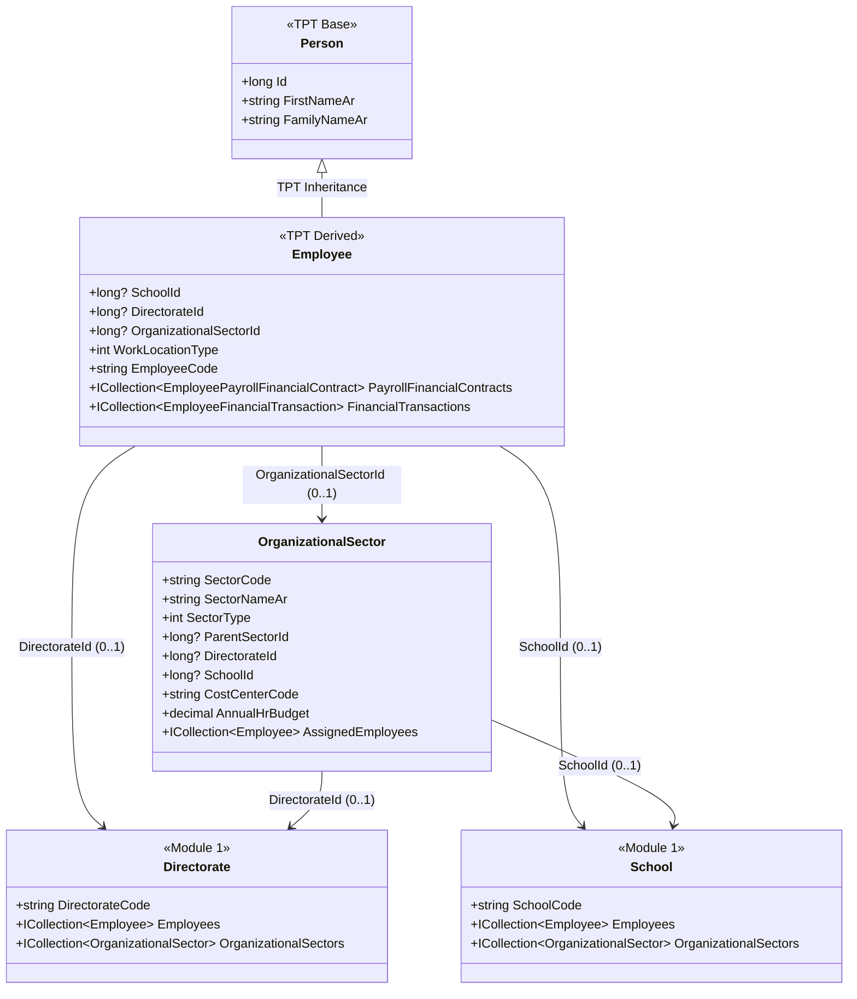

# تقرير التحرر المعماري الشامل وتوسعة الموارد البشرية متعددة القطاعات (الوحدة الثالثة - Module 3)
**Universal Multi-Sector HR Architecture & Inter-Module Integration Report**

---

## 1. الملخص التنفيذي والأهداف الاستراتيجية (Executive Summary)

تم إنجاز **التحرر المعماري الكامل (Universal Sector Decoupling)** لهيكل وموجودات **الوحدة الثالثة: إدارة الموارد البشرية وشؤون الموظفين (`M3_EmployeeManagement`)** بنجاح تام وبناءً على معايير البنية النظيفة (Clean Architecture) وتوافقية قاعدة بيانات **Oracle 19c**.

كانت الهيكلية السابقة تربط الموظفين بشكل إلزامي وحصري بالنطاق المدرسي (`SchoolId` غير قابل للملء بقيمة `NULL`)، وهو ما قيد قدرة النظام عن إدارة الكوادر البشرية في القطاعات الإدارية والقيادية والتوجيهية الأخرى. تم في هذه المرحلة فصل الموظف وسجلاته التشغيلية والمالية عن الارتباط المدرسي الإجباري، وتحويل الوحدة الثالثة إلى **نظام موارد بشرية مؤسسي شامل (Universal Multi-Sector HR Subsystem)** قادر على إدارة الموظفين عبر جميع قطاعات المنظومة التعليمية:
1. **الوزارة والإدارات المركزية (Central Ministry Departments)**
2. **الإدارات العامة ومكاتب التعليم الإقليمية (Regional Directorates / Educational Offices)**
3. **المدارس والمجمعات التعليمية (Localized Schools & Campuses)**
4. **مراكز التوجيه والإرشاد والقياس (Guidance & Counseling Centers)**
5. **مستودعات الأصول والدعم اللوجستي (Logistics & Asset Depots)**
6. **مراكز الاختبارات والتقييم والقطاعات الأخرى (Examination & Specialized Centers)**

---

## 2. الهيكل المعماري والقطاعي الجديد (Universal Multi-Sector Architecture)

### 2.1 إدخال كيان القطاع التنظيمي (`OrganizationalSector`)
تم إنشاء كيان محوري مستقل داخل `M3_EmployeeManagement` باسم **`OrganizationalSector`** يمثل أي وحدة أو قطاع عمل تنظيمي داخل المؤسسة التعليمية، مع دعم التسلسل الهرمي للقطاعات (`ParentSectorId`) وربطه بمراكز التكلفة المالية (`CostCenterCode`) والميزانيات السنوية (`AnnualHrBudget`).

### 2.2 تحرير كيان الموظف الرئيسي (`Employee`) من قيد المدرسة الإلزامي
تم الحفاظ بنسبة 100% على نمط الوراثة الفئوية التامة (Table-Per-Type - TPT) المشتق من كيان `Person`، مع إجراء التحويلات الجوهرية التالية على كيان `Employee`:
- **تحويل `SchoolId` إلى حقل اختياري (`long? SchoolId`)**: لتمكين تسجيل موظفي الوزارة، مكاتب التعليم، والمستودعات دون المطالبة بمعرف مدرسة.
- **إضافة حقول الارتباط الهيكلي الشامل**:
  - `long? DirectorateId`: لربط الموظف مباشرة بمكتب التعليم / الإدارة الإقليمية.
  - `long? OrganizationalSectorId`: لربط الموظف بوحدة العمل أو القطاع التابع له.
  - `int WorkLocationType`: تصنيف الموقع التشغيلي (`1=CentralMinistry`, `2=RegionalDirectorate`, `3=LocalSchool`, `4=GuidanceCenter`, `5=LogisticsDepot`, `6=Other`).
- **إضافة خصائص التنقل الافتراضية (Virtual Navigation Properties)**: لضمان التحميل اللاحق الذكي (Lazy Loading Proxy Support) عبر `virtual Directorate? Directorate` و `virtual OrganizationalSector? OrganizationalSector`.

---

## 3. تحرير وتعميم السجلات الفرعية (Sub-Records Decoupling & Expansion)

شمل التحرير المعماري وتعميم القطاعات جميع الكيانات التابعة والتشغيلية في الموارد البشرية (26 كياناً)، حيث تم تحويل حقول `SchoolId` الإلزامية إلى حقول اختيارية (`long? SchoolId`)، وإضافة معرفات وخصائص تنقل القطاعات (`DirectorateId` و `OrganizationalSectorId`) لتشمل:

| الكيان الفرعي (Entity Name) | نوع السجل في الموارد البشرية | حالة قيد المدرسة (`SchoolId`) | الدعم الإضافي للقطاعات والمكاتب (`Directorate / Sector`) |
| :--- | :--- | :--- | :--- |
| **`EmployeeAttendance`** | سجلات الحضور والانصراف اليومي | **اختياري (`long?`)** | مدعوم بالكامل مع خصائص التنقل (`Directorate`, `OrganizationalSector`) |
| **`TeacherSchedule`** | الجداول الدراسية ونصاب الحصص | **اختياري (`long?`)** | مدعوم لتمكين ندب المعلمين بين المدارس والمكاتب |
| **`EmployeePayroll`** | كشوف الرواتب والاستحقاقات الشهرية | **اختياري (`long?`)** | مدعوم ومربوط بعقد ارتباط مالي مستقل للوحدة الخامسة (M5) |
| **`EmployeeLeave`** | الإجازات السنوية والمرضية والاضطرارية | **اختياري (`long?`)** | مدعوم لكافة موظفي المكاتب والمدارس والقطاعات |
| **`EmployeePerformanceReview`** | تقييم الأداء والمؤشرات الوظيفية (KPIs) | **اختياري (`long?`)** | مدعوم لتقييم القيادات والمشرفين وموظفي الدعم الإداري |
| **`EmployeeViolation`** | المخالفات والجزاءات ولجان التحقيق | **اختياري (`long?`)** | مدعوم لتنفيذ اللوائح الانضباطية على مستوى كافة النطاقات |
| **`EmployeeTraining`** | الدورات التدريبية والابتعاث وتطوير الكفاءات | **اختياري (`long?`)** | مدعوم لتسجيل تكاليف ومخرجات التدريب لجميع الموظفين |
| **`EmployeeInternalTransfer`** | حركات النقل الداخلي بين الأقسام والقطاعات | **اختياري (`long?`)** | مدعوم للنقل الداخلي في المكاتب والمدارس والوزارة |
| **`EmployeeExternalTransfer`** | حركات النقل الخارجي والندب والإعارة | **اختياري (`FromSchoolId` / `ToSchoolId`)** | تمت إضافة `From/To DirectorateId` و `From/To OrganizationalSectorId` |
| **`EmployeeTermination`** | إنهاء الخدمة وإخلاء الطرف الإداري والمالي | **اختياري (`long?`)** | مدعوم لإجراء التسويات ومكافآت نهاية الخدمة لكافة الموظفين |
| **`EmployeeCommittee` & `EmployeeMeeting`** | اللجان الوظيفية ومحاضر الاجتماعات الرسمية | **اختياري (`long?`)** | مدعوم لتشكيل لجان إقليمية ومركزية واجتماعات مكاتب التعليم |
| **`EmployeeAdditionalTask` & `EmployeeMentor`** | التكليفات والمهام الإضافية والإرشاد المهني | **اختياري (`long?`)** | مدعوم لتكليف المشرفين والمستشارين بمهام ميدانية وإشرافية |
| **`VacantPosition` & `JobApplicant`** | الوظائف الشاغرة وإدارة استقطاب المرشحين | **اختياري (`long?`)** | مدعوم لنشر وظائف مكاتب التعليم والمستودعات والمدارس |

---

## 4. مصفوفة الترابط البيني الشامل عبر الوحدات (Cross-Module Integration Matrix)

تم إرساء شبكة متكاملة وثنائية الاتجاه من العلاقات والارتباطات (`virtual ICollection<T>`) بين الوحدة الثالثة (`M3`) وبقية وحدات النظام، بما يضمن عمل المنظومة ككيان مؤسسي متناغم ومتزامنة بشكل مطلق:

### 4.1 الترابط مع الوحدة الأولى (`M1_SchoolAdmin` - الإدارة المدرسية والقيادة الإقليمية)
- **الإدارات والمدارس (`Directorate` & `School`)**: تمت إضافة مجموعات التنقل `virtual ICollection<Employee> Employees` و `virtual ICollection<OrganizationalSector> OrganizationalSectors` إلى كلا الكيانين لربط كوادر المكاتب والمدارس بمرجعيتها.
- **التعاميم الرسمية (`OfficialCircular`)**: تم ربط التعميم بالموظف المُصدر للتعميم (`IssuerEmployeeId` -> `IssuerEmployee`) وإتاحة وصول الموظف للتعاميم الصادرة عنه (`IssuedCirculars`).
- **الزيارات الإشرافية (`EducationalSupervisionVisit`)**: تم ربط سجل الزيارة الإشرافية بكل من المشرف التربوي الزائر (`SupervisorEmployeeId` -> `SupervisorEmployee`) والمعلم أو الموظف المزار (`VisitedTeacherEmployeeId` -> `VisitedTeacherEmployee`) مع إنشاء مجموعات `ConductedSupervisionVisits` و `ReceivedSupervisionVisits` في كيان الموظف.
- **الفصول والجداول (`Classroom` & `ClassSchedule`)**: تم تأكيد وتفعيل ارتباط معلم الصف رائد الفصل (`HomeroomTeacherEmployeeId` -> `HomeroomTeacherEmployee`) وارتباط نصاب الحصص وجداول التدريس (`AssignedEmployeeId` -> `AssignedEmployee`).

### 4.2 الترابط مع الوحدة الثانية (`M2_StudentAffairs` - شؤون الطلاب والتوجيه الطلابي)
- **جلسات التوجيه والإرشاد النفسي (`StudentPsychologicalCounselingLog`)**: تم تأكيد ربط جلسات الإرشاد الطلابي بالموظف المرشد النفسي/التربوي (`CounselorEmployeeId` -> `CounselorEmployee`) وإضافة مجموعة التنقل `ConductedCounselingSessions` في كيان الموظف.
- **سجلات الضبط الميداني والمخالفات السلوكية (`BehavioralLog`)**: مدعومة بروابط رصد المخالفة من قبل الموظف المختص (`RecordedByEmployeeId`).

### 4.3 الترابط مع الوحدة الرابعة (`M4_AssetLogistics` - الأصول والمستودعات والخدمات اللوجستية)
- **الأصول المدرسية والمؤسسية (`SchoolAsset`)**: تم ربط الموظف بالأصول المسلمة إليه كعهدة مباشرة أو إشراف (`AssignedAssets`) وكشوف التسليم والاستلام (`EmployeeInventoryCustodies`).
- **أصناف المخزون (`InventoryItem`)**: تم تفعيل ارتباط العهدة التفصيلية لأصناف المخزون (`AssignedInventoryItems`).
- **المرافق والمباني (`SchoolFacility`)**: تم تفعيل ربط المشرف الميداني بالمرفق المسؤول عن سلامته وجاهزيته (`SupervisedFacilities`).

### 4.4 جسر التكامل المالي مع الوحدة الخامسة (`M5_FinancialManagement` - الشؤون المالية والرواتب)
لضمان تكامل الرواتب والحركات المالية مع الأستاذ العام ودفاتر القيود في الوحدة الخامسة دون تداخل الطبقات أو انتهاك البنية الموحدة، تم إنشاء كيانين تعاقديين متخصصين داخل الوحدة الثالثة يعملان كعقود ارتباط مالي (`Bridge Contracts`):
1. **كيان عقد الارتباط المالي للرواتب (`EmployeePayrollFinancialContract`)**:
   يربط كشف الراتب الشهري (`EmployeePayroll`) بمراكز التكلفة (`CostCenterCode`) وبنود الميزانية (`BudgetLineCode`) ورقم مرجع الحركة المالية (`FinancialTransactionReferenceNumber`) وحالة الصرف المالي (`DisbursementStatus`).
2. **كيان الحركات والمطالبات المالية للموظفين (`EmployeeFinancialTransaction`)**:
   سجل مالي مؤسسي شامل يرصد كافة المطالبات والحركات المالية غير الراتب الأساسي (السلف المالية، بدلات الانتداب والسفر، تعويضات الدورات التدريبية، التمويين الطبي، ومستحقات نهاية الخدمة)، ومجهز برمز ربط قسيمة الصرف في الوحدة الخامسة (`Module5VoucherReference`).

---

## 5. إحصائيات البناء وتوافقية Oracle 19c (Build Verification & Compliance)

| المؤشر المعماري | النتيجة والحالة | الملاحظات الفنية |
| :--- | :--- | :--- |
| **حالة تجميع مشروع الدومين (`dotnet build EduMS.Domain.csproj`)** | **ناجح (Build Succeeded)** | **0 أخطاء (Errors) / 0 تحذيرات (Warnings)** في بيئة .NET 10 |
| **إجمالي الكيانات في الوحدة الثالثة (`M3_EmployeeManagement`)** | **26 كياناً مستقلين ومتكاملين** | تشمل كياني التحرر الجديدين (`OrganizationalSector` و العقود المالية) |
| **الحفاظ على وراثة التمييز الفئوي (`Person` -> `Employee`)** | **محفوظة بنسبة 100% (TPT Pattern)** | دون أي تكرار للحقول الشخصية الأساسية (الاسم، الجندر، تاريخ الميلاد) |
| **التوافق التام مع محرك Oracle 19c** | **متوافق بنسبة 100%** | التزام صارم بـ `PascalCase`، أنواع القيمة البدائية، `decimal` للأموال، و `long` للمعرفات |
| **دعم التحميل اللاحق الذكي (Lazy Loading Proxy Support)** | **مفعل بالكامل** | كافة الخصائص ومجموعات التنقل معرفة بمعدّل `virtual` وميأه بـ `new List<T>()` |

---
*تم إعداد هذا التقرير والاعتماد النهائي للهيكلية المعمارية المتحررة للوحدة الثالثة بواسطة Antigravity AI — كافة الكيانات والارتباطات مجازة وجاهزة للمرحلة التشغيلية اللاحقة.*
