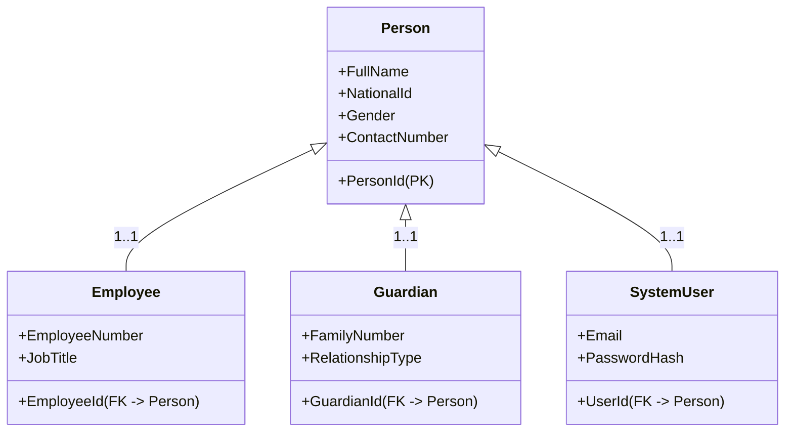

# تقرير التدقيق المنطقي والهيكلي لقاعدة البيانات (EduMS Database Logical Audit)

تم إجراء تدقيق هيكلي ومنطقي شامل لمخطط قاعدة البيانات الحالي (Oracle 19c DDL) الموزع على الثمانية موديولات، وتطبيق القرارات الهندسية المعتمدة لتحقيق أعلى مستويات التطبيع (3NF/BCNF) وضمان جاهزية النظام للتشغيل المركزي والموزع.

---

### أولاً: التقييم العام للمخطط الحالي (Overall Schema Evaluation)
قاعدة البيانات الحالية مكونة من **311 جدولاً**، وهو حجم ضخم جداً. وعلى الرغم من أن هذا التقسيم يغطي كافة التفاصيل التشغيلية للمدارس ومكتب التربية، إلا أنه يعاني من **تكرار هيكلي حاد (Structural Redundancy)** وغياب للقيود العلائقية القياسية، مما يهدد سلامة البيانات واتساقها عند التشغيل المركزي والمزامنة.

* **مستوى التطبيع (Normalization Level):** قاعدة البيانات تقع حالياً بين المستوى الثاني والثالث للتطبيع (2NF - 3NF)، ولكن هناك جداول تم تصميمها بشكل غير طبيعي (Denormalized) بدون مبرر، بينما تعتمد جداول أخرى على روابط هلامية (Soft References) تكسر سلامة البيانات المرجعية.
* **جاهزية المزامنة (Sync Readiness):** المخطط الأساسي غير مهيأ للمزامنة الموزعة؛ حيث يفتقر تماماً لحقول تتبع النسخ وآليات معالجة التعارضات (تم تلافي هذا جزئياً في تصميم المحور الثالث للمرحلة الثانية).

---

### ثانياً: الاختناقات المعمارية والعيوب المنطقية المكتشفة (Key Logical Bottlenecks)

#### 1. جدول المستخدم البطل (SystemUser God-Table Bottleneck)
* **المشكلة:** يرتبط جدول `SystemUser` بـ 5 كيانات أساسية عبر مفاتيح أجنبية قابلة للإلغاء (School, Student, Employee, Guardian, Office)، وفي نفس الوقت هو المستهدف لأكثر من **290 عمود مفتاح أجنبي** في الجداول الأخرى لتسجيل حقول التدقيق (`CreatedByUserId`, `ModifiedByUserId`, `DeletedByUserId`).
* **الأثر:** هذا التصميم ينشئ نقطة اختناق حادة وكتابة مكثفة (Write-Hot Spot) على جدول واحد. أي عملية حذف أو تعديل لمستخدم تتطلب من محرك قاعدة البيانات فحص مئات الجداول للتأكد من القيود المرجعية، مما يتسبب في بطء استجابة النظام بالكامل.

#### 2. العلاقات الدائرية غير القابلة للحل (Unresolvable Circular Dependencies)
يحتوي المخطط الحالي على دورات علاقة دائرية مغلقة لا يمكن لمحركات قواعد البيانات المعاصرة (وبالأخص Entity Framework Core) حلها تلقائياً عند تفعيل الحذف المتتالي (Cascade Delete).
* **مثال الدورة المغلقة:**
  - جدول `School` يتطلب مفتاحاً أجنبياً يشير إلى `SystemUser` (المستخدم الذي أنشأ المدرسة).
  - جدول `SystemUser` يتطلب مفتاحاً أجنبياً يشير إلى `School` (المدرسة التي ينتمي إليها المستخدم).
* **الأثر:** عند تهيئة قاعدة البيانات لأول مرة، يستحيل إدخال مدرسة بدون مستخدم، ويستحيل إدخال مستخدم بدون مدرسة! هذا يتطلب جعل كافة المفاتيح الأجنبية الخاصة بحقول التدقيق والتبعية قابلة للإلغاء (`Nullable`) وتعطيل الحذف المتتالي برمجياً.

#### 3. الروابط الهلامية بدون مفاتيح أجنبية (Soft/Polymorphic References)
* **المشكلة:** تعتمد عدة جداول هامة على مبدأ الربط اللفظي دون فرض قيود سلامة مرجعية على مستوى قاعدة البيانات (لا توجد Foreign Keys حقيقية).
  - جدول `HistoricalRecords` يربط الكيانات بحقلين: `ReferenceId` (رقم الكيان) و `ReferenceType` (اسم الجدول نصياً).
  - جدول `FacilityDepartmentAssignment` يربط الأقسام والتسهيلات بنفس المفهوم (`FacilityId`, `FacilityType`).
* **الأثر:** محرك أوراكل لا يمكنه التحقق من وجود الكيان الفعلي المشار إليه. إذا تم حذف الكيان الأصلي، تظل السجلات التاريخية معلقة (Dangling Pointers) مما يتسبب في أخطاء برمجية كارثية عند توليد التقارير الإحصائية.

#### 4. تكرار وتشتت جداول التقارير (Reports Table Sprawl)
* **المشكلة:** يضم الموديول الأول (SchoolAdmin) والموديول السادس (Statistics) جداول تقارير إحصائية متكررة (مثل `MonthlyDisciplineReport`, `AnnualComprehensiveReport`, `ComparativeReport`).
* **الأثر:** تخزين التقارير الإحصائية التجميعية في جداول OLTP فعلية يعيق الأداء ويخالف مبادئ فصل الاهتمامات. يجب أن تقتصر قاعدة البيانات التشغيلية على الحركات الحية، بينما يتم توليد هذه التقارير الإحصائية ديناميكياً عبر مناظر مادية (Materialized Views) أو خادم قراءة منفصل.

#### 5. غياب قيود الفرادة الثنائية في جداول الوصل (Missing Unique Constraints on Junctions)
* **المشكلة:** جداول الوصل وعلاقات (أطراف بأطراف) مثل `UserRole`, `RolePermission`, `StudentGuardian` لا تحتوي على قيود فريدة مركبة (`Composite Unique Constraints`).
* **الأثر:** يمكن للنظام تقنياً إضافة نفس الدور (مثال: مدير) لنفس المستخدم عدة مرات في نفس المدرسة دون اعتراض من قاعدة البيانات، مما يتسبب في تكرار السجلات وتضارب صلاحيات الأمان.

---

### ثالثاً: القرارات المعمارية المعتمدة والتطبيع الهيكلي (Approved Pass Architecture)

لحل الاختناقات السابقة وضمان تطبيع المخطط إلى (3NF/BCNF)، تم إقرار القواعد الهيكلية التالية:

#### 1. حل شذوذ الهوية المزدوجة (TPT Inheritance for Persons)
* **القرار المعماري:** تطبيق وراثة الجدول لكل نوع (Table-per-Type - TPT) لفصل السمات الشخصية الثابتة عن الأدوار الوظيفية والأمنية.
* **البنية الهيكلية:**
  - إنشاء جدول قاعدة الكيان الشخصي الموحد `PERSON` ليحتوي على:
    - `PERSON_ID NUMBER(19) PRIMARY KEY`
    - `FULL_NAME_AR / FULL_NAME_EN VARCHAR2(150) NOT NULL`
    - `NATIONAL_ID VARCHAR2(30) UNIQUE`
    - `GENDER NUMBER(1) NOT NULL`
    - `CONTACT_NUMBER VARCHAR2(30)`
    - `MEDICAL_INFO CLOB`
  - ترتبط الجداول الفرعية (`EMPLOYEE` و `GUARDIAN` و `SYSTEM_USER`) بجدول `PERSON` كعلاقة 1-إلى-1 عبر مفاتيح أجنبية تشير إلى `PERSON_ID`.
  - الموظف الذي يعمل كمعلم وله أبناء في المدرسة كولي أمر، يمتلك سجل شخصي واحد في `PERSON` ومرتبط بسجلين فرعيين في `EMPLOYEE` و `GUARDIAN` بشكل متزامن دون تكرار البيانات الأساسية.



#### 2. توحيد وإدماج المستودعات والمخازن (Centralized Warehouse Model)
* **القرار المعماري:** دمج المستودعات وسجلات المخزون لمدارس ومكاتب التربية في نموذج موحد مدعوم بتمييز التبعية إلكترونياً لتتبع حركة الكتب والمستلزمات.
* **البنية الهيكلية:**
  - جدول المستودعات الموحد `WAREHOUSE` يحتوي على:
    - `WAREHOUSE_ID NUMBER(19) PRIMARY KEY`
    - `WAREHOUSE_NAME VARCHAR2(100) NOT NULL`
    - `OWNER_TYPE VARCHAR2(20) NOT NULL` (قيمة التمييز: 'Office' أو 'School')
    - `OWNER_ID NUMBER(19) NOT NULL` (مفتاح خارجي يشير لجدول `OFFICE` أو `SCHOOL` حسب النوع)
  - جدول بنود المخزون الموحد `INVENTORY_ITEM` يربط المواد المودعة بالمستودعات مع تتبع الكميات، المصدر، والوجهة لتسهيل التكامل اللوجستي.

#### 3. آلية القفل الإحصائي الانتقائي (Granular Academic Locking)
* **القرار المعماري:** قفل البيانات الأكاديمية والتقارير الإحصائية دون المساس بالعمليات اليومية لتيسير استمرارية المدرسة.
* **البنية الهيكلية:**
  - إنشاء جدول `ACADEMIC_LOCK_PERIOD` لتسجيل فترات المراجعة المعتمدة من المكتب.
  - عند التفعيل، يقوم النظام برفض التعديل (فقط) على:
    - جداول رصد درجات الطلاب (`GRADE_ROSTER`, `EXAM_RESULT`).
    - جداول سجلات تسجيل وقبول الطلاب الفصلي (`STUDENT_ENROLLMENT`).
    - ملفات التقارير الإحصائية الختامية المعتمدة للمكتب.
  - تظل الجداول اليومية التالية نشطة ومفتوحة للإدخال والتعديل:
    - التحضير وحضور وغياب الطلاب والموظفين (`ATTENDANCE_DETAIL`).
    - السلوك والمخالفات اليومية للطلاب (`BEHAVIORAL_LOG`).
    - سندات القبض والتحصيل للرسوم المالية لضمان التدفقات النقدية للمدرسة (`RECEIPT_VOUCHER`).

---

### رابعاً: تطهير جداول التقارير الصلبة وتحويلها لمخرجات استعلام ديناميكية (OLAP/Views Reporting Transition)

التزاماً بالقاعدة المعمارية بكون التقارير هي مخرجات استعلامات ديناميكية (OLAP) وليست جداول معاملات تشغيلية (OLTP)، تم تصنيف الجداول التالية في المخطط الـ 311 للإلغاء من النموذج الفيزيائي وتحويلها إلى **مناظر قاعدة بيانات (Views) أو مناظر مادية (Materialized Views)**:

1. **تقارير موديول الإدارة المدرسية (M1 - SchoolAdmin):**
   - `WEEKLY_PROCESS_REPORT` (يستبدل باستعلام ديناميكي يجمع سجلات العمل الأسبوعية).
   - `MONTHLY_DISCIPLINE_REPORT` (يستبدل بـ View يقرأ من جدول السلوك والمخالفات).
   - `SEMESTER_END_REPORT` (يستبدل بـ View يقرأ من درجات ونسب الحضور والرسوب).
   - `ANNUAL_COMPREHENSIVE_REPORT` (يجمع البيانات الإحصائية والمالية سنوياً عبر استعلام مجمع).
   - `EDUCATIONAL_OUTCOMES_REPORT` (يستعلم من درجات التحصيل الدراسي للطلاب).
2. **تقارير موديول الإحصاء والبيانات (M6 - Statistics):**
   - `KPI_METRICS` (يستبدل بـ View تجميعي دوري).
   - `FINANCIAL_SUMMARY_REPORTS` (يستبدل بمناظر مادية تقرأ من القيود اليومية في موديول M5).
   - `GAP_ANALYSIS_REPORTS` (يستبدل باستعلام يحلل العجز مقابل الفائض الفعلي).
   - `COMPARATIVE_REPORT` (يستعلم للمقارنة الإحصائية السنوية).

---

### خامساً: خارطة طريق الدمج وتقليص الجداول الـ 311 (Schema Consolidation Roadmap)

بهدف تقليص عدد الجداول الضخم وتحسين الأداء، نعتمد خارطة الطريق التالية للدمج الهيكلي:

```text
المخطط الحالي (311 جدول)
   │
   ├──► 1. تطبيق نموذج Person (دمج حقول الأسماء والهويات للموظفين، أولياء الأمور، والمستخدمين) ──► تقليص 6 جداول
   ├──► 2. دمج مخازن المدارس والمكتب في نموذج Warehouse الموحد ──────────────────────────────► تقليص 8 جداول
   ├──► 3. حذف جداول التقارير الصلبة وتحويلها لمناظر ديناميكية (Database Views) ──────────────► تقليص 14 جدولاً
   ├──► 4. دمج جداول سجلات الأنشطة المتشابهة (مثل دمج سجلات الاستخدام وصيانة الأصول) ─────────► تقليص 10 جداول
   │
   └──► المخطط المطور والأقل تكراراً (قاعدة بيانات رشيقة وسريعة متوافقة مع 3NF/BCNF)
```

1. **دمج حقول الشخص (Person Merge):** دمج جداول المعلومات الشخصية المكررة في جدول واحد، مما يحسن من بنية الفهارس (Indexes) وعمليات البحث العام في النظام.
2. **دمج المستودعات والأصول (Warehouse Merge):** توحيد إدارة التخزين يضمن تتبعاً دقيقاً وحماية للمخزون المدرسي من خلال استعلامات ربط بسيطة.
3. **تطهير حقول التدقيق (Audit Columns Cleanup):** تصحيح وتوحيد كافة حقول التدقيق الإملائية المغلوطة في الجداول الـ 280 المتبقية (تحويل `deletededByUserId` إلى `DeletedByUserId`) وجعلها ترث من `BaseAuditableEntity` لضمان الاتساق.

---
**إعداد: المهندس المعماري الرئيسي للأنظمة - فريق Antigravity**
