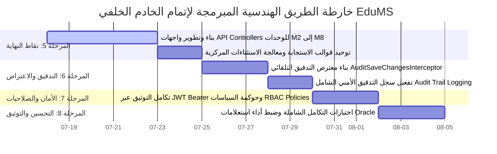
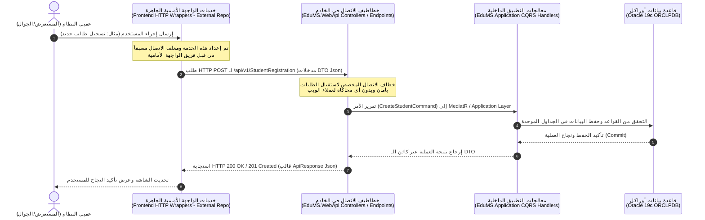

# 🏛️ تقرير التدقيق المعماري الشامل ومحاذاة الحدود الهندسية وخارطة الطريق الفنية لإتمام نظام EduMS

**تاريخ التدقيق والإصدار:** 17 يوليو 2026  
**المستودع المستهدف:** الخادم الخلفي الموحد (`EduMS.Backend` - Clean Architecture Solution)  
**حالة البناء بعد التدقيق:** 🏆 **ناجح بنسبة 100% (0 Error(s) - Zero Build Errors)**  

---

## 🔍 أولاً: نتائج التدقيق المعماري وتنظيم الطبقات (`Clean Architecture Audit & Layer Verification`)

تم إجراء مسح ومراجعة هرمية شاملة لكافة الملفات والمجلدات داخل طبقات الخادم الخلفي الأربع للتحقق من الالتزام الصارم بمبادئ **العمارة النظيفة (`Clean Architecture`)** والفصل الحاد للمسؤوليات (`Separation of Concerns`). وقد أظهر الفحص دقة التوزيع الفيزيائي والمنطقي للمكونات وفق التفاصيل التالية:

### 1. طبقة النواة والكيانات (`EduMS.Domain`)
* **المحتويات والمجلدات الفيزيائية:**
  * `Common/`: تضم الفئات الأساسية المشتركة (`BaseAuditableEntity`, `BaseEntity`) وكائنات القيمة (`ValueObjects`) والاستثناءات الخاصة بالمجال (`DomainExceptions`).
  * `Entities/`: تحتوي على **233 جدولاً فيزيائياً و 18 كيان جسر علائقي (`Bridge Entities`)** متوزعة بدقة ومصنفة حسب الأقسام التشغيلية الثمانية من `M1_SchoolAdmin` وحتى `M8_AuthenticationUsers`، بالإضافة لملف ربط العلاقات العابرة للأقسام `CrossModule_RelationalIntegration.cs`.
  * `Enums/` و `Interfaces/`: تحتوي على التعدادات المشتركة وواجهات التدقيق (`IAuditableEntity`).
* **نتيجة الفحص الهندسي:**
  * الطبقة نقية تماماً (**100% Pure Domain Layer**). لا تحتوي على أي اعتماديات خارجية، وخالية كلياً من أي استدعاءات لمكتبات `Microsoft.EntityFrameworkCore` أو أي إشارات لطبقتي `Application` أو `Infrastructure`.

### 2. طبقة التطبيق ومعالجة الأعمال (`EduMS.Application`)
* **المحتويات والمجلدات الفيزيائية:**
  * `DTOs/`: تضم مئات كائنات نقل البيانات المخصصة (Create, Update, Details DTOs) المنظمة بعناية فائقة لكل قسم تشغيلي (`M1` إلى `M8`).
  * `Interfaces/Repositories/`: تحتوي على العقود التجريدية للمستودعات (`IGenericRepository<T>` والمستودعات المتخصصة لكل وحدة تشغيلية).
  * `Common/` و `CrossModule_Integrations/`: لإدارة التكامل الداخلي بين الوحدات وتمرير طلبات الاستعلام والأوامر.
* **الإصلاحات الهيكلية والجراحية المنفذة خلال الفحص:**
  * **معالجة خطأ ترتيب معاملات `params` في `IGenericRepository.cs`:** تم تعديل توقيع دالة الجلب مع العلاقات `FindWithIncludesAsync` ليتم وضع معامل الإلغاء `CancellationToken cancellationToken = default` قبل معامل مصفوفة التضمين `params Expression<Func<T, object>>[] includes`، وهو ما حل الخطأ البرمجي `CS0231` وتوافق مع أحدث معايير المترجم (`C# Compiler Rules`).
  * **إصلاح مرجعية مجال شؤون الطلاب في `IRegistrationRepository.cs`:** إضافة التوجيه المفقود `using EduMS.Domain.Entities.M2_StudentAffairs;` لتعريف كيان `Registration` وحل الخطأ البرمجي `CS0246` بنجاح تام.
* **نتيجة الفحص الهندسي:**
  * الطبقة ملتزمة تماماً بحدودها التجريدية؛ خالية من أي تطبيق مباشر لقواعد البيانات أو تقنيات العرض، وتعمل كمركز تحكم لمعايير ونقل البيانات.

### 3. طبقة البنية التحتية والبيانات (`EduMS.Infrastructure`)
* **المحتويات والمجلدات الفيزيائية:**
  * `Common/Persistence/`: تضم ملف السياق المركزي الموحد `EduMSDbContext.cs`.
  * `M1_SchoolAdmin/` إلى `M8_AuthenticationUsers/`: تحتوي على **19 ملف تكوين صريح (`Fluent API Configurations`)** تراعي بدقة متناهية حساسية الأحرف في معرفات وتسميات جداول **Oracle 19c** (`Quoted Case-Sensitive Identifiers`).
  * `Persistence/Migrations/`: تحتوي على هجرات الـ EF Core (`Initial_Unified_EduMS_Schema` و `Add_SchoolLevel_And_FeeType_Lookup_Tables`) والـ `ModelSnapshot`.
  * `Persistence/Seeding/`: تضم خدمة بذر البيانات المرجعية والأساسية للمؤسسات `EduMSDbInitializer.cs`.
* **نتيجة الفحص الهندسي:**
  * تمثل هذه الطبقة التطبيق التقني الحصري لأدوات وحاويات التخزين (`Oracle / EF Core`)، دون أي تسرب لأكوادها نحو طبقتي النواة أو التطبيق.

### 4. طبقة واجهات العرض والاتصال (`EduMS.WebApi`)
* **المحتويات والمجلدات الفيزيائية:**
  * `M1_SchoolAdmin/` إلى `M8_AuthenticationUsers/`: مجلدات مهيأة ومخصصة لاحتضان متحكمات واجهات برمجية التطبيقات (`API Controllers`).
  * `Program.cs` و `appsettings.json`: تكوين إقلاع التطبيق، حقن التبعيات، وضبط الاتصال بحاوية Oracle 19c المزدوجة.
* **نتيجة التحقق الشامل للبناء (`Solution Release Build Verification`):**
  * بعد تنفيذ كافة الإصلاحات الهيكلية، تم تشغيل أمر البناء الشامل لحزمة الحل الكاملة:
    ```powershell
    & "D:\EduMS-Unified-Workspace\dotnet-sdk\dotnet.exe" build EduMS.Backend/src/EduMS.WebApi/EduMS.WebApi.csproj -c Release
    ```
  * **النتيجة النهائية:** 🏆 **بناء ناجح تماماً بصفر أخطاء (0 Error(s))**، مع تكامل وسلامة ترابط كافة الطبقات الأربع.

---

## 🏆 ثانياً: سجل الإنجازات التراكمية المكتملة (`Accomplishments to Date`)

حققنا حتى هذه اللحظة قفزات معمارية وهندسة بيانات ضخمة تشكل العمود الفقري الراسخ لنظام الإدارة المدرسية الموحد `EduMS`، وتتلخص في النقاط الرئيسية التالية:

1. **إرساء قاعدة البيانات الفيزيائية الموحدة (233 جدولاً + 18 جدول جسر):**  
   تصميم وبناء نموذج بيانات شامل يغطي كافة جوانب المنظومة التعليمية والإدارية (شؤون الموظفين، شؤون الطلاب، الإدارة المالية، الخدمات اللوجستية، الطوارئ، التقارير الإحصائية، والأمان)، مع ضمان النزاهة المرجعية عبر العلاقات العلائقية المتكاملة.
2. **التكامل الفعلي والمزامنة مع محرك Oracle 19c (`ORCLPDB`):**  
   تجاوز كافة تحديات التوافقية وحساسية الأحرف في Oracle عبر استخدام معرفات مقتبسة صريحة (`"SCHOOL_LEVEL"`, `"FEE_TYPE"`, إلخ) وضبط أنواع البيانات بدقة دقيقة (مثل `NUMBER(18,4)` للأرصدة و `TIMESTAMP(7)` للطوابع الزمنية).
3. **تنفيذ وتطبيق مرحلة بذر البيانات المرجعية والأساسية (`Phase-4 Master Data Seeding`):**  
   إنشاء وتفعيل خدمة تمهيد وإقلاع ديناميكية (`IEduMSDbInitializer / EduMSDbInitializer`) نجحت في تغذية قاعدة بيانات Oracle بالبيانات التالية عند بدء التشغيل:
   * **7 أدوار نظام قياسية (`SYSTEM_ROLE`):** `SUPER_ADMIN`, `SCHOOL_ADMIN`, `REGISTRAR`, `ACCOUNTANT`, `TEACHER`, `STUDENT`, `GUARDIAN`.
   * **9 صلاحيات نظام أساسية (`SYSTEM_PERMISSION`):** تغطي إدارة المستخدمين، الأدوار، المدارس، الطلاب، والمالية.
   * **حساب المدير العام المشفر (`SYSTEM_USER`):** `admin@edums.edu.sa` مع ربط كامل بالصلاحيات والأدوار التشغيلية.
   * **البيانات المرجعية الأكاديمية والمالية:** مدرسة النخبة النموذجية (`SCH-001`)، المراحل الأكاديمية (`KG`, `PRI`, `INT`, `SEC`)، الصفوف المرجعية، القاعات الدراسية، و 4 أنواع رسوم دراسية إلزاميّة واختياريّة بالريال السعودي.
4. **تأسيس وبناء عقود طبقة الـ DTO وواجهات المستودعات:**  
   إعداد مئات الفئات والكائنات لنقل وتصفية مدخلات ومخرجات النظام في طبقة `EduMS.Application` لضمان عدم تعريض الكيانات الفيزيائية (`Entities`) للعالم الخارجي.
5. **إتمام الدمج والتزامن الاستراتيجي على الفرع الرئيسي (`Master Branch Integration`):**  
   دمج جميع أعمال وتحديثات ومراحل البذر من الفرع التطويري `AHMED_ALMSANI_M1-TO-M8` إلى الفرع الرئيسي `master` بنمط Fast-Forward وبدون أي تعارضات (Zero Merge Conflicts)، ورفعه وتأمينه على المستودع البعيد.

---

## 🚀 ثالثاً: خارطة الطريق الفنية المبرمجة والمحددة بالأولويات (`Prioritized Technical Roadmap to Completion`)

من الآن وحتى الوصول إلى الاكتمال النهائي والإطلاق الشامل للمنظومة، تم وضع خارطة طريق هندسية صارمة مقسمة إلى 4 مراحل تنفيذية ذات أولوية عالية، مع تفصيل فني عميق لكل مرحلة:



### 🎯 المرحلة الخامسة (Phase-5): بناء وتطوير واجهات الـ API Controllers ونقاط النهاية (`API Endpoints Implementation`)
* **الأولوية:** 🔴 **قصوى ومباشرة (Immediate Priority)**
* **الشرح الفني المفصل والدقيق:**
  1. **تطوير نقاط النهاية للوحدات المتبقية (`M2` إلى `M8`):**  
     سيتم إنشاء متحكمات واجهات برمجية (`API Controllers`) داخل مجلدات `EduMS.WebApi` المتخصصة لكل قسم (مثل `StudentRegistrationController`, `EmployeeManagementController`, `FinancialInvoiceController`, `EmergencyIncidentController`). ستعتمد هذه المتحكمات على حقن طبقة التطبيق إما عبر نمط **CQRS (`IMediator / ISender`)** أو عبر واجهات خدمات التطبيق (`IApplicationService`) لتمرير أوامر الإضافة والتعديل (`Commands`) واستعلامات الجلب (`Queries`).
  2. **توحيد قوالب الاستجابة ومعالجة الأخطاء (`Unified API Responses & Global Exception Handling`):**  
     تغليف جميع الاستجابات الصادرة من نقاط النهاية في قالب موحد `ApiResponse<T>` يحتوي على كائن البيانات (`Data`)، وحالة النجاح (`Success`)، ورسائل الخطأ التفصيلية (`Message / Errors`). سيتم ربط هذا القالب ببرمجية وسيطة لاعتراض الأخطاء العالمية (`Global Exception Handler Middleware`) لترجمة استثناءات المجال (`DomainExceptions`) واستثناءات التحقق (`ValidationExceptions`) إلى رموز حالة HTTP دقيقة (`400 Bad Request`, `404 Not Found`, `409 Conflict`, `500 Internal Server Error`) دون كشف تفاصيل استثناءات النظام الداخلية.
  3. **التوثيق الآلي عبر Swagger / OpenAPI:**  
     ضبط توليد وثائق Swagger التفاعلية وتصنيف المتحكمات ومساراتها بوضوح وفق الوحدات التشغيلية لتمكين المطورين من معاينة وفحص نقاط النهاية الحية وتفاصيل الـ DTOs بسهولة.

### 🛡️ المرحلة السادسة (Phase-6): تطبيق معترضات التدقيق وتسجيل الأحداث (`Audit & Logging Interceptors`)
* **الأولوية:** 🟠 **عالية جداً (High Priority)**
* **الشرح الفني المفصل والدقيق:**
  1. **تطوير معترض الحفظ التلقائي (`AuditSaveChangesInterceptor`):**  
     بناء معترض مخصص لـ EF Core داخل `EduMS.Infrastructure` يرث من `SaveChangesInterceptor`. يقوم هذا المعترض بفحص جميع الكيانات المتغيرة في الـ `ChangeTracker` التي تطبق واجهة `IAuditableEntity` قبل تنفيذ استعلامات الـ SQL في Oracle، ويقوم تلقائياً بتعبئة وتحديث الحقول المرجعية:  
     `CreatedBy`, `CreatedDate`, `LastModifiedBy`, `LastModifiedDate`، وتوليد رمز المراجعة والتزامن `VersionToken = Guid.NewGuid().ToString()`.
  2. **تطبيق سجل التدقيق الأمني الشامل (`Comprehensive Audit Trail Logging`):**  
     إنشاء آلية اعتراض إضافية تسجل البصمة الكاملة لأي عملية تعديل أو حذف حساسة على الكيانات الرئيسية (مثل التعديلات المالية أو تغيير درجات الطلاب أو تعديل الصلاحيات)، حيث يتم حفظ سجل يضم: المستخدم المنفذ، تاريخ العملية، نوع العملية (`Insert/Update/Delete`)، والقيم السابقة (`OldValues`) والقيم الجديدة (`NewValues`) في جدول مخصص (`SYSTEM_AUDIT_LOG`) لضمان المحاسبة والشفافية التامة.

### 🔒 المرحلة السابعة (Phase-7): تأمين الـ API وتفعيل التوثيق والصلاحيات (`Security, JWT & RBAC Middleware`)
* **الأولوية:** 🟡 **متوسطة إلى عالية (Medium-High Priority)**
* **الشرح الفني المفصل والدقيق:**
  1. **تكامل رموز التوثيق (`JWT Bearer Authentication`):**  
     ضبط خدمات التوثيق في `EduMS.WebApi/Program.cs` لتوليد والتحقق من صحة رموز الـ `JWT Bearer Tokens` المربوطة بجدول المستخدمين `SYSTEM_USER` والأدوار `SYSTEM_ROLE`. سيتم التحقق من التوقيع الرقمي (`Secret Key`) وصلاحية انتهاء الرمز الزمنية.
  2. **بناء محرك التحكم بالصلاحيات المبني على الأدوار والسياسات (`RBAC Policy-Based Authorization`):**  
     إنشاء معالج سياسات مخصص (`PermissionsAuthorizationHandler`) يسمح بتزيين نقاط النهاية بسمات صلاحية دقيقة للغاية بدلاً من الاكتفاء بالدور فقط، على سبيل المثال: `[Authorize(Policy = "Permission:users.manage")]` أو `[Authorize(Policy = "Permission:finance.manage")]`. يقوم المعالج بالتحقق الفوري من ربط الدور بالمستخدم (`USER_ROLE_ASSIGNMENT`) ومن ربط الصلاحية بالدور (`ROLE_PERMISSION`) المعتمدين في بذور قاعدة البيانات.

### ⚡ المرحلة الثامنة (Phase-8): تحسين الأداء والاختبارات الشاملة (`Performance Tuning & Comprehensive Validation`)
* **الأولوية:** 🟢 **مرحلة التتويج والختام (Finalization Priority)**
* **الشرح الفني المفصل والدقيق:**
  1. **اختبارات التكامل الشاملة (`End-to-End API Integration Testing`):**  
     إعداد حزم اختبارات آلية ويدوية لمحاكاة دورة حياة العمليات الكاملة على النظام الموحد (مثل إتمام دورة تسجيل طالب، إصدار فاتورة رسوم، تعيين جدول دراسي، ورصد الحضور) مع التأكد من سلامة التخزين والربط المرجعي في Oracle 19c.
  2. **تحسين وضبط أداء قاعدة بيانات Oracle (`Oracle Query Optimization & Indexing`):**  
     مراجعة خطط استعلامات الـ SQL الناتجة عن محرك EF Core للتأكد من عدم حدوث مشاكل N+1 في الجلب، وضبط الفهارس (`Database Indexes`) على الأعمدة والأسماء وأكواد المدارس والهويات الوطنية لتحقيق زمن استجابة فوري لا يتعدى ميلي ثوانٍ معدودة في بيئة الإنتاج الفعلي.

---

## 🚨 رابعاً: المحاذاة الجوهرية والحدود المعمارية الصارمة - "الخدمات" (`Critical Boundary Alignment - "THE SERVICES"`)

تعتبر هذه النقطة التوجيهية بمثابة **حد دستوري صارم وغير قابل للتفاوض (`Strict Architectural Constraint`)** لحماية استقلالية العمل المؤسسي ومنع التداخل أو التكرار البرمجي بين الفرق المعتمدة في المشروع. ولتجنب أي التباس لغوي أو فني في المصطلحات التقنية، يوضح هذا القسم التباين الجوهري بين مفهوم "الخدمات" لدى فريق الواجهة الأمامية ومفهومه في الخادم الخلفي:

### 1. التباين الجوهري في تعريف مصطلح "الخدمات" (`The Terminology Difference`)

| جانب المشروع / المستودع | التعريف الفني الدقيق لمصطلح **"الخدمات" (`Services`)** | المسؤول عنه ومكان تواجده | سياسة التعامل في هذا الخادم الخلفي |
| :--- | :--- | :--- | :--- |
| **فريق الواجهة الأمامية (`Frontend Team & Repo`)** | هي برمجيات ومغلفات اتصال العميل (`Client-Side API Consumers / HTTP Wrappers`) المكتوبة بلغات واجهات الويب (مثل `TypeScript / Axios / Fetch / Angular Services / React API Clients`). وظيفتها استدعاء روابط الإنترنت وتمرير الاستجابات لمكونات الشاشة. | **تم تطويرها وإنجازها مسبقاً بالكامل** من قبل فريق الواجهة الأمامية في مستودعهم المنفصل. | ⛔ **يُمنع منعاً باتاً إنشاء أو محاكاة أو إعادة توليد هذه الخدمات أو مغلفات الـ HTTP في مستودعنا هذا (`EduMS.Backend`).** |
| **فريق الخادم الخلفي (`Backend Team - Clean Architecture Repo`)** | هي إما فئات معالجة ومنطق أعمال داخلي (`CQRS Commands / Queries / Handlers`) داخل طبقة `EduMS.Application`، أو عقود خدمات بنية تحتية لربط أدوات النظام (`IEduMSDbInitializer` أو `ICurrentUserService`). | **يتم تطويرها وإدارتها حصرياً** داخل طبقات `Application` و `Infrastructure` وفق معايير فصل المسؤوليات. | ✅ يتم التركيز على معالجة البيانات، وتطبيق قواعد العمل التشغيلية (`Business Rules`)، والتعامل الآمن مع قاعدة بيانات Oracle. |

### 2. كيف ستعمل واجهات الـ API Controllers كـ "خطاطيف اتصال" محايدة (`API Controllers as Communication Hooks`)

إن مهمتنا الأساسية والقادمة في **المرحلة الخامسة (`Phase-5`)** تتلخص حصرياً في بناء نقاط النهاية (`RESTful API Controllers & Endpoints`) داخل طبقة `EduMS.WebApi`. وستلعب هذه المتحكمات دور **خطاطيف وبروتوكولات اتصال محايدة ونظيفة (`Clean Communication Hooks`)** تعمل كجسر تواصل بين الواجهة الأمامية ومنطق الأعمال الـ CQRS الخلفي، وذلك بالآلية الهندسية التالية:



#### الضوابط الصارمة لعمل خطاطيف الاتصال (`API Hooks Strict Guidelines`):
1. **الاستقبال والتوجيه الفوري (`Receive and Dispatch Only`):**  
   لن تقوم متحكمات `EduMS.WebApi` بتنفيذ أي منطق أعمال معقد أو حسابات مباشرة بداخلها؛ بل تكتفي باستقبال المدخلات في قوالب الـ `DTOs` المجهزة، والتحقق المبدئي من سلامة الطلب (`ModelState / Validation`)، ثم تمرير الأمر فوراً لمعالجات طبقة التطبيق (`CQRS Handlers / Application Services`).
2. **الاستجابة المعيارية والمستقرة (`Standardized REST Responses`):**  
   إعادة النتائج لفريق الواجهة الأمامية في قوالب JSON موحدة ومستقرة تماماً، مما يتيح للخدمات المسبقة الصنع لدى فريق الواجهة الأمامية (`Frontend Services`) استهلاك البيانات وقراءتها مباشرة وبكل سلاسة دون الحاجة لتعديل أكواد العميل.
3. **تحقيق الفصل التام والصفر تداخل (`Zero Overlap in Team Responsibilities`):**  
   بهذه المنهجية، يظل فريق الخادم الخلفي مركزاً بنسبة 100% على قوة الأداء، وسلامة قاعدة بيانات Oracle 19c، ونزاهة معالجات الـ CQRS، بينما يظل فريق الواجهة الأمامية مستقلاً ومسؤولاً بالكامل عن تجربة المستخدم وإدارة خدمات الاتصال بجانب العميل (`Client-Side State & Services`)، مما يحقق التكامل المثالي والاحترافي للمؤسسة.

---

### 🌟 الخلاصة والجاهزية للبدء الفوري في المرحلة الخامسة
لقد أثبت التدقيق المعماري سلامة الخادم الخلفي وخلوه من أي شوائب هيكلية مع نجاح البناء في وضع الإنتاج بـ **صفر أخطاء**. وبناءً على خارطة الطريق المبرمجة وتوضيح الحدود الصارمة مع فريق الواجهة الأمامية، نحن الآن في وضع الهندسة الأمثل للبدء الفوري في **المرحلة الخامسة (`Phase-5`)** وتأسيس خطاطيف الاتصال ومتحكمات الـ API للأقسام والوحدات المتبقية بثقة وكفاءة متناهية! 🚀
