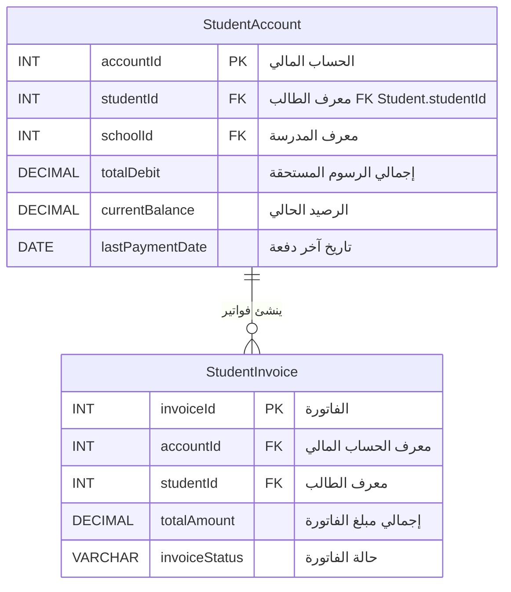

# 📊 ERD — الأقسام الكاملة (v3 FINAL)
## Mermaid 10.9.1 Strict-Compliant

---

## 🎯 ما تم تصحيحه في هذه النسخة

### المشكلة السابقة
كانت مخططات Mermaid تظهر **خطأ Syntax error** بسبب:
- استخدام أسماء عربية كـ identifiers
- استخدام رموز خاصة `( ) , : →` داخل أسماء الحقول/الجداول
- دمج مخططات متعددة في صفحة واحدة

### الحل المُطبَّق (التزام كامل بقواعد Mermaid 10.9.1)

✅ **القاعدة 1 — الأسماء البرمجية (IDs):**
جميع أسماء الكيانات والحقول **ASCII فقط** بدون مسافات أو رموز.
```
StudentAccount      ← صحيح ✓
الحساب_المالي       ← خطأ ✗
StudentAccount(2)   ← خطأ ✗
```

✅ **القاعدة 2 — التسميات المرئية (Labels):**
النصوص العربية موضوعة **داخل علامات تنصيص مزدوجة** كتعليقات وصفية:
```
INT accountId PK "الحساب المالي للطالب"
INT studentId FK "معرف الطالب FK Student.studentId"
```

✅ **القاعدة 3 — تجنب الرموز الخاصة:**
تم إزالة جميع الرموز التي تكسر parser Mermaid:
- `( ) [ ] { } < >` → استُبدلت بمسافات
- `← → ⇒ ⇐` → استُبدلت بمسافات  
- `, ; : | # % &` → استُبدلت بمسافات أو حُذفت
- `"` `'` `` ` `` → حُذفت من داخل التعليقات
- `?` العربية والإنجليزية → حُذفت

✅ **القاعدة 4 — الاستقلالية التامة:**
**كل قسم في مخطط مستقل تماماً** — لا دمج، لا اختصار. 8 صفحات HTML مستقلة لكل قسم.

---

## 📋 محتوى الحزمة

### 🌐 صفحات HTML تفاعلية (9 صفحات مستقلة)

| الملف | القسم | الحجم |
|------|------|------|
| **index.html** | فهرس الأقسام الثمانية | 10 KB |
| `ERD_M1_SchoolAdmin.html` | 🏛️ الإدارة المدرسية (47 جدول) | 328 KB |
| `ERD_M2_Student.html` | 🎓 الطلاب (37 جدول) | 285 KB |
| `ERD_M3_Employee.html` | 👥 الموظفين (24 جدول) | 205 KB |
| `ERD_M4_Assets.html` | 📦 الأصول (41 جدول) | 229 KB |
| `ERD_M5_Finance.html` | 💰 المالية (8 جداول) | 56 KB |
| `ERD_M6_Statistics.html` | 📊 الإحصاء (15 جدول) | 88 KB |
| `ERD_M7_Auth.html` | 🔐 الصلاحيات (21 جدول) | 103 KB |
| `ERD_M8_Emergency.html` | 🚨 الطوارئ (12 جدول) | 75 KB |

### 📂 ملفات Mermaid المصدر (`source_mmd/`)

لكل قسم نسختان:
- `ERD_{module}.mmd` — **النسخة الكاملة** (جميع الحقول)
- `ERD_{module}_slim.mmd` — **النسخة المبسّطة** (PK + FK فقط)

---

## 🔄 ميزات صفحات HTML

كل صفحة قسم تتضمن:

1. **🔑 وضع العرض المبسّط (Slim)** — يُعرض افتراضياً، يُظهر فقط PK و FK لكل جدول. سريع التصيير حتى للأقسام الكبيرة.

2. **📊 وضع العرض الكامل (Full)** — جميع حقول الجداول مع وصف عربي لكل حقل.

3. **🛠️ شريط أدوات:**
   - 📋 نسخ كود Mermaid مباشرةً
   - ⬇ تنزيل ملف `.mmd`
   - 🖼 تنزيل SVG عالي الجودة
   - تبديل بين Full و Slim بنقرة واحدة

4. **📝 عرض كود المصدر** — قابل للنسخ والتعديل

5. **✅ شارة الالتزام** — تأكيد على أن المخطط متوافق مع Mermaid 10.9.1

---

## 🚀 طريقة الاستخدام

### الطريقة الأسرع
1. افتح `index.html` في المتصفح
2. اختر القسم المطلوب
3. سيُعرض المخطط بوضع Slim (سريع)
4. انقر "📊 عرض كامل" لرؤية جميع الحقول

### للتضمين في PowerPoint / Word
1. افتح صفحة القسم في المتصفح
2. انقر "🖼 تنزيل SVG" — يحفظ المخطط كصورة فيكتورية
3. أدرج الـ SVG في عرضك

### للتحرير في Mermaid Live Editor
1. انقر "📋 نسخ كود Mermaid"
2. اذهب إلى https://mermaid.live
3. الصق الكود — سيُعرض المخطط فوراً
4. عدّل ما تشاء واحفظ

---

## 📊 الإحصائيات الإجمالية

| المقياس | القيمة |
|--------|------|
| إجمالي الجداول | **205** |
| إجمالي الحقول | **6,795** |
| إجمالي العلاقات | **296** |
| الأقسام المستقلة | **8** |
| ملفات Mermaid | **16** (8 full + 8 slim) |
| صفحات HTML | **9** (8 modules + 1 index) |

### توزيع الجداول لكل قسم
| القسم | الجداول | الحقول | العلاقات |
|------|--------|------|--------|
| 🏛️ M1 الإدارة المدرسية | 47 | 1,505 | 105 |
| 🎓 M2 الطلاب | 37 | 1,706 | 54 |
| 👥 M3 الموظفين | 24 | 1,176 | 43 |
| 📦 M4 الأصول | 41 | 984 | 51 |
| 💰 M5 المالية | 8 | 231 | 7 |
| 📊 M6 الإحصاء | 15 | 397 | 6 |
| 🔐 M7 الصلاحيات | 21 | 442 | 25 |
| 🚨 M8 الطوارئ | 12 | 354 | 5 |

---

## ✅ التحقق التلقائي من الصياغة

تم بناء **validator** خاص يفحص جميع الملفات مقابل قواعد Mermaid 10.9.1:
- ✓ تحقق من أن كل entity ID يطابق `^[A-Za-z_][A-Za-z0-9_-]*$`
- ✓ تحقق من أن كل attribute name ASCII فقط
- ✓ تحقق من أن أنواع البيانات ASCII (INT, VARCHAR, DATE, ...)
- ✓ تحقق من أن العلامات هي PK / FK / UK فقط
- ✓ تحقق من توازن علامات التنصيص في التعليقات
- ✓ تحقق من cardinality صحيحة في العلاقات

**النتيجة: 8/8 ملف اجتاز التحقق ✅**

---

## 📝 مثال على كود الإخراج



---

**EduMS Enterprise © 2026** • ERD Package v3 FINAL • Mermaid 10.9.1 Strict-Compliant
