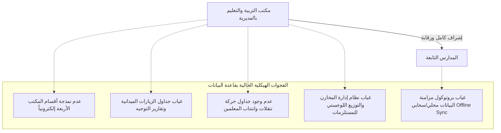
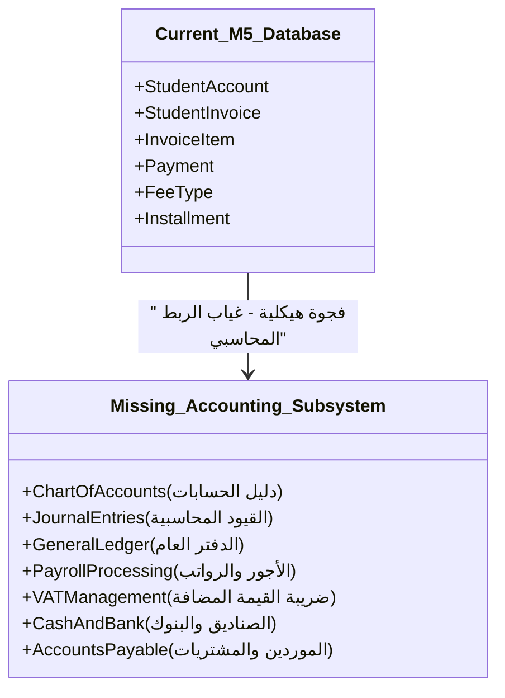

# تقرير التدقيق المعماري والتحليل الشامل لنظام إدارة الموارد التعليمية (EduMS)
## المرحلة الأولى: التدقيق الشامل والاكتشاف الهيكلي (Global Audit & Discovery)

---

### أولاً: ملخص مسح وجرد ملفات مساحة العمل (File Inventory Summary)

تم إجراء مسح شامل وجرد تفصيلي لكافة الملفات الموجودة في مساحة العمل الموحدة `d:\EduMS-Unified-Workspace`. تم تصفية واستبعاد مجلدات البناء وملفات البيئة التطويرية غير الضرورية (مثل `.vs` و `venv` و `bin` و `obj` و `.git`) لتركيز التحليل على الأصول الهيكلية والوثائق التحليلية للمشروع.

#### 1. بنية مساحة العمل الأساسية
تتكون مساحة العمل من مستندات تنظيمية، ملفات Excel إحصائية، تقارير سير العمل الميداني، بالإضافة إلى أرشيفات مضغوطة تحتوي على وثائق مشروع التخرج الرئيسي وقواعد البيانات.
* **الأرشيف الرئيسي المستكشف:** تم فك ضغط الأرشيف الأحدث والأهم للمشروع وهو: `اخر واهم ملفات مشروع التخرج.zip` إلى مجلد مخصص باسم `unpacked_graduation_project`.
* **مخططات قاعدة البيانات (ERD):** يحتوي المجلد الفرعي `unpacked_graduation_project\ملفات المشروع\Edit_ERD_Package_v3_FINAL\` على مخططات الكيانات والعلاقات (ERDs) بصيغة تفاعلية (HTML تعتمد على مكتبة Mermaid) لثمانية (8) موديولات برمجية مستقلة.

#### 2. الإحصائيات الكمية لملفات مساحة العمل
* **عدد الملفات الإجمالي بعد التصفية:** ما يزيد عن 50 ملفاً وثائقياً وتحليلياً رئيسياً.
* **توزيع امتدادات الملفات الفعالة:**
  - **ملفات المستندات والنصوص (DOCX, TXT, PDF):** تحتوي على وثائق جمع المتطلبات، تحليل الكيانات المعمق، وتفاصيل العمليات البرمجية لكل موديول.
  - **جداول البيانات (XLSX, XLS):** تحتوي على النماذج الإحصائية والتقارير الإدارية الفعلية لمكاتب التربية والتعليم بالمديريات (مثل العجز والفائض، حضور وغياب المعلمين، المخازن، والرقابة الميدانية).
  - **ملفات الويب والمخططات (HTML):** تحتوي على مخططات Mermaid التفاعلية التي تصف العلاقات بين جداول قاعدة البيانات.

---

### ثانياً: خريطة تتبع النسخ وإلغاء التكرار (Version Mapping & Deduplication)

تتميز مساحة العمل بوجود مستندات مكررة نتيجة تكرار التعديلات والمراجعات التاريخية للمشروع. تم فحص هذه الملفات بدقة بالاعتماد على التواريخ وحجم الملفات لتحديد **النسخة الأكثر نضجاً واعتماداً كمرجع رئيسي (Source of Truth)**.

#### 1. خريطة مطابقة الملفات وتحديد النسخ المعتمدة

| اسم الملف الأساسي | النسخ المكررة المكتشفة | النسخة المعتمدة كمرجع (الأكثر نضجاً) | مبرر الاختيار والفرق الهيكلي |
| :--- | :--- | :--- | :--- |
| **تحليل كيان المدرسة** | 1. `تحليل كيان المدرسة.docx`<br>2. `كيان المدرسة_043418.docx`<br>3. `تحليل كيان المدرسة_20260201_172531.docx` | **`تحليل كيان المدرسة_20260201_172531.docx`** (المستخرج كملف نصي) | تحتوي هذه النسخة على التعديل الأحدث (بتاريخ 1 فبراير 2026)، وتتضمن تفاصيل أكثر شمولاً لعمليات الاعتماد الأكاديمي، إعدادات الفترات الدراسية، والربط التفصيلي مع مكتب التربية. |
| **ملف جمع المتطلبات** | 1. `ملف جمع المطلبات والعمليات والتقارير.docx`<br>2. `ملف جمع المطلبات والعمليات والتقارير-1.docx`<br>3. `ملف جمع المطلبات والعمليات والتقارير-1_20260203_121945.docx` | **`ملف جمع المطلبات والعمليات والتقارير-1_20260203_121945.docx`** | تمثل النسخة الأحدث في مساحة العمل (بتاريخ 3 فبراير 2026)، وتضم تعديلات وتصحيحات لإجراءات التكامل وتصدير/استيراد ملفات Excel. |
| **تحليل كيان الطالب** | 1. `التحليل كيان الطلاب.docx`<br>2. `تحليل كامل لكيان الطالب_021903_20260123_141916.docx` | **`التحليل كيان الطلاب.docx`** (الذي تم استخراجه بنجاح) | يحتوي على التفاصيل الكاملة والشاملة لكافة حقول وبيانات الطلاب الأكاديمية والطبية وشؤون التسجيل مقارنة بالمسودات التاريخية الأخرى. |
| **الاستمارات والاستبيانات** | 1. `Questionnaire.docx` (11 KB)<br>2. `Questionnaire_١٠٤٤٣٩.docx` (18.7 KB) | **`Questionnaire_١٠٤٤٣٩.docx`** | تحتوي النسخة المؤرخة على أسئلة إضافية ومحدثة تتعلق باحتياجات مديري المدارس الخاصة والتكامل الإحصائي مع مكاتب المديريات. |
| **استبيان المدرسة الخاصة** | 1. `استبيان المدرسة الخاصة 1_١٠٤٥٣٢.docx`<br>2. `استبيان المدرسة الخاصة 1_١٢١٣٤٦.docx`<br>3. `استبيان المدرسة الخاصة 2_١٠٤٥٠٧.docx` | **`استبيان المدرسة الخاصة 1_١٢١٣٤٦.docx`** مع **`استبيان المدرسة الخاصة 2`** | النسخة الأولى تمثل أحدث استمارة متكاملة للقسم الأول من البيانات، بينما يغطي الاستبيان رقم 2 بيانات البنية التحتية والترخيص. |
| **مخططات قاعدة البيانات (ERD)** | مخططات متعددة متناثرة في مساحات عمل قديمة. | **المخططات داخل المجلد الفرعي `Edit_ERD_Package_v3_FINAL`** | تمثل المخططات النهائية للمرحلة الثالثة (V3 Final) والتي تم مراجعتها لتجنب بعض العلاقات الدائرية والاعتماد المتبادل. |

---

### ثالثاً: تحليل معمق لهيكل "مكتب التربية والتعليم" بالمديرية (Deep-Dive: Office of Education)

من خلال دراسة الملفات الخاصة بـ "مكتب التربية" في مساحة العمل (الموجودة في مسار `ملفات مكتب التربيه` الفرعي)، تبين أن مكتب التربية والتعليم بالمديرية يمارس سلطة إشرافية ورقابية كاملة على المدارس المحيطة به من خلال أربعة أقسام إدارية رئيسية.

#### 1. أقسام مكتب التربية والتعليم وبنيتها الوظيفية

##### أ. قسم الإحصاء والبيانات (Statistics Department)
* **المستندات المرتبطة:** `استمارة تحديث البيانات الإحصائية 2025-2026م ن1 (تم الإصلاح).docx`.
* **الدور الوظيفي:** جمع البيانات الإحصائية الشاملة من المدارس بشكل سنوي ونصف سنوي لتحديث قاعدة البيانات المركزية.
* **البيانات المستهدفة بالجمع:**
  - أعداد الطلاب الموزعين حسب الصفوف والجنس.
  - أعداد المعلمين والإداريين حسب المسميات الوظيفية والتخصصات الأكاديمية ونوع العقد.
  - بيانات البنية التحتية للمدارس (عدد القاعات الدراسية، المعامل، المرافق الصحية، أجهزة الكمبيوتر المتاحة).
  - إحصائيات التصفية والرسوب والتسرب الدراسي.
* **الفجوة البرمجية:** يتم تنفيذ هذا الإجراء حالياً بالكامل عبر استمارات ورقية أو ملفات Excel منفصلة، ويفتقر النظام البرمجي الحالي إلى واجهات إدخال مخصصة لمسؤولي الإحصاء بالمكتب للتحقق الآلي من مطابقة وصحة البيانات المرفوعة من المدارس قبل اعتمادها النهائي.

##### ب. قسم التعليم (Education Department)
* **المستندات المرتبطة:** `العجز والفائض مربع مركز المديرية.xlsx` و `تقرير الزيارة الميدانية والاخطار.xlsx`.
* **الدور الوظيفي:** الإشراف على توزيع الحصص الدراسية وإدارة القوى البشرية (المعلمين) للتأكد من سد أي عجز في المدارس.
* **العمليات التشغيلية:**
  - **إدارة العجز والفائض:** رصد التخصصات التي تعاني من نقص في المعلمين وتوزيع المعلمين الزائدين عن الحاجة من مدارس أخرى.
  - **الزيارات الميدانية والتوجيه:** إرسال الموجهين للمدارس لإجراء تقييم ميداني لسير العملية التعليمية وكتابة تقارير زيارة ميدانية وإرسال إخطارات رسمية للمدارس لتصحيح المخالفات.
* **الفجوة البرمجية:** نموذج الكيانات (Database Schema) لا يحتوي على أي جداول لإدارة حركة المعلمين الانتقالية (نقل، انتداب، سد عجز) أو أرشفة ومتابعة تقارير الزيارات الميدانية والتوجيه الفني الصادرة من المكتب.

##### ج. قسم التوجيه والاختبارات (Guidance & Exams Department)
* **المستندات المرتبطة:** `نموذج رصد درجات الفصل الاول 25-26.xlsx`، `حركة التنقلات 2026م.xls`، و `المخازن.xlsx`.
* **الدور الوظيفي:** إدارة وتنسيق الامتحانات الفصلية والنهائية، وتوزيع الكتب والمستلزمات الدراسية.
* **العمليات التشغيلية:**
  - **إدارة الامتحانات:** الإشراف على لجان الامتحانات، توزيع الطلاب على أرقام الجلوس، رصد درجات الكنترول المركزي، وإعلان النتائج.
  - **إدارة المخازن والدعم اللوجستي:** متابعة استلام الكتب المدرسية والمستلزمات من الوزارة وتوزيعها على مخازن المدارس بناءً على الكثافة الطلابية.
* **الفجوة البرمجية:** تدار هذه العمليات عبر سجلات يدوية وملفات Excel مستقلة. لا يوجد في قاعدة البيانات الحالية جداول لإدارة المخازن المركزية على مستوى المكتب، أو إدارة أرقام الجلوس والكنترول المركزي للامتحانات النهائية على مستوى المديرية.

##### د. قسم الرقابة والتفتيش المالي والإداري (Inspection & Supervision Department)
* **المستندات المرتبطة:** `غياب مارس 2025م.xlsx` و `تقارير الرقابة.xlsx`.
* **الدور الوظيفي:** التدقيق المالي والإداري على المدارس، ومتابعة الانضباط العام للمعلمين والإداريين.
* **العمليات التشغيلية:**
  - **متابعة الانضباط:** مراجعة حافظة الدوام اليومية والتقرير الشهري للغياب والإجازات للمعلمين والموظفين بالمدرسة.
  - **التدقيق المالي:** الإشراف على صرف المنح المدرسية (مثل منحة التطوير المدرسي) والتحقق من أوجه الصرف المالية بناءً على نموذج التقرير المالي النصفي المعتمد من مكتب التربية والتعليم بالمديرية.
* **الفجوة البرمجية:** نظام التحليل الحالي لا يوفر واجهات رقابية للمفتشين الإداريين لمراجعة حوافظ الدوام الرقمية للمدارس بشكل مباشر، أو جداول تفصيلية في قاعدة البيانات لربط بنود صرف المنح المدرسية للمدارس بالاعتمادات المالية الصادرة من المكتب.

---

### رابعاً: الفجوات الهيكلية في قاعدة البيانات لضمان المركزية المطلقة (Database Gaps Analysis)

من خلال تدقيق مخطط الكيانات الحالي للموديول الأول (Module 1 - SchoolAdmin)، تم تحديد الفجوات الحرجة التي تحول دون تحقيق المركزية الكاملة لربط المدارس بمكتب التربية بالمديرية:



1. **نمذجة الأقسام الإدارية للمكتب:** 
   * **الوضع الحالي:** يحتوي جدول `Office` فقط على حقول البيانات التعريفية الأساسية للمكتب ورابط التكامل الخارجي (API).
   * **الفجوة:** لا يوجد في قاعدة البيانات نمذجة تفصيلية للأقسام الأربعة (الإحصاء، التعليم، التوجيه، الرقابة) أو الهيكل الإداري الداخلي للمكتب وصلاحيات الموظفين التابعين له.
2. **غياب جداول حركة تنقلات وانتداب المعلمين:**
   * **الوضع الحالي:** ترتبط الكوادر التعليمية بجدول المدرسة الرئيسي بشكل مباشر.
   * **الفجوة:** غياب جداول تدعم طلبات وحركات الانتداب، النقل الإداري، وسد العجز بين المدارس تحت إشراف قسم التعليم بالمكتب.
3. **غياب تقارير الزيارات الميدانية والرقابة والتوجيه:**
   * **الوضع الحالي:** التقارير محصورة في العمليات الإدارية داخل المدرسة.
   * **الفجوة:** عدم وجود تمثيل برملي لتقارير الموجهين والرقابة المالية والإدارية التي يرفعها مفتشو المكتب بعد زيارة المدارس.
4. **مزامنة البيانات غير المتصلة بالإنترنت (Offline Data Synchronization):**
   * **الوضع الحالي:** قاعدة البيانات مصممة كبيئة مركزية متصلة بشكل مستمر.
   * **الفجوة:** أشار العميل في استجابته بالأسئلة التوضيحية إلى أن خدمة الإنترنت غير متوفرة دائماً، وبالتالي يحتاج النظام إلى آلية تخزين محلي بالمدارس ومزامنة ثنائية الاتجاه (Local-First Sync to Cloud) مع خوادم المكتب المركزي عند توفر الاتصال. قاعدة البيانات الحالية لا تحتوي على حقول تتبع المزامنة (`SyncStatus`, `VersionToken`, `LastSyncedAt`) أو جداول معالجة تعارضات المزامنة.

---

### خامساً: التحليل المعمق للموديل المالي (M5 Finance) والفجوات الهيكلية

من خلال مقارنة وثيقة الواجهات الأمامية (Frontend Report) ومتطلبات شاشات المحاسبين والتقارير المالية التشغيلية مع مخطط قاعدة البيانات المادي الحالي لموديول المالية (M5 Finance)، تم اكتشاف **فجوة هيكلية بالغة الخطورة**. 

#### 1. الفجوة الهيكلية الكبرى (The 6-Table Bottleneck)
يقتصر المخطط الفعلي للموديول المالي حالياً على **6 جداول فقط**، وهي:
1. `StudentAccount`: حساب الطالب المالي الأساسي.
2. `StudentInvoice`: فواتير الطلاب.
3. `InvoiceItem`: بنود تفاصيل الفواتير.
4. `Payment`: عمليات السداد والدفع.
5. `FeeType`: أنواع الرسوم الدراسية.
6. `Installment`: جدول تقسيط الرسوم.

بالمقابل، تتطلب العمليات المحاسبية الأساسية المدرجة في متطلبات النظام شاشات متكاملة لإدارة المحاسبة المالية للمدرسة والمكتب والتي تعتبر غير ممثلة نهائياً في قاعدة البيانات الحالية.

#### 2. متطلبات واجهات المحاسبة غير الممثلة في قاعدة البيانات (Gaps Details)



##### أ. دليل الحسابات وشجرة الحسابات (Chart of Accounts - CoA)
* **المتطلب البرمجي للواجهات:** شجرة حسابات مرنة (تتكون من الأصول، الالتزامات، حقوق الملكية، الإيرادات، والمصروفات) تسمح للمحاسب بتصنيف الحركات المالية للمدرسة.
* **الفجوة في قاعدة البيانات:** لا توجد جداول لتنظيم الحسابات المحاسبية العامة (`Account` و `AccountCategory`). جميع العمليات المالية في قاعدة البيانات الحالية تدور فقط حول حسابات الطلاب الفرعية (`StudentAccount`)، مما يجعل تتبع الحسابات التشغيلية للمدرسة (مثل رواتب الكادر، إيجارات المباني، صيانة الأصول، المشتريات) مستحيلاً محاسبياً.

##### ب. القيود اليومية والدفتر العام (Journal Entries & General Ledger)
* **المتطلب البرمجي للواجهات:** واجهات تمكن المحاسب من إدخال قيود يومية مزدوجة الطرف (Debit/Credit) لتوثيق المصروفات والإيرادات، مع توليد ميزان المراجعة، قائمة الدخل، والميزانية العمومية.
* **الفجوة في قاعدة البيانات:** غياب كامل لجداول القيود اليومية ورؤوس وسطور القيود (`JournalEntry` و `JournalEntryLine` و `GeneralLedger`). العمليات المالية الحالية (الفواتير والمدفوعات) لا تنشئ حركات محاسبية حقيقية ولا يتم ترحيلها إلى أي حسابات أستاذ عام.

##### ج. إدارة الأجور ورواتب المعلمين والموظفين (Payroll integration)
* **المتطلب البرمجي للواجهات:** شاشات احتساب الرواتب الشهرية للموظفين والمعلمين، البدلات، الخصومات الناتجة عن الغياب (المرتبطة بموديول الموظفين M3)، وإصدار كشوفات الرواتب (Payroll Sheets) والتحويلات البنكية.
* **الفجوة في قاعدة البيانات:** لا توجد صلة برمجية في قاعدة البيانات بين الموديول المالي M5 وموديول الموظفين M3. تفتقر قاعدة البيانات لجداول حساب الرواتب، تفاصيل الرواتب، بنود الدفع، والخصومات المحاسبية.

##### د. ضريبة القيمة المضافة والتصاريح الضريبية (VAT & Tax Compliance)
* **المتطلب البرمجي للواجهات:** نظام احتساب وإصدار الفواتير الضريبية متوافق مع متطلبات الهيئة الضريبية، رصد ضريبة المدخلات (المشتريات) وضريبة المخرجات (الرسوم)، وتقديم الإقرارات الضريبية الدورية.
* **الفجوة في قاعدة البيانات:** تحتوي الفاتورة على حقول مبسطة (`taxAmount`, `taxRate`) ولكن لا توجد أي جداول لدورة العمل الضريبية الكاملة (إقرارات، فترات ضريبية، تسويات ضريبية، وسجل الأرقام الضريبية للجهات الموردة).

##### هـ. إدارة المشتريات والموردين (Accounts Payable & Vendors)
* **المتطلب البرمجي للواجهات:** شاشات تسجيل فواتير المشتريات وصرف مستحقات الموردين للكتب والأثاث المدرسي.
* **الفجوة في قاعدة البيانات:** لا يوجد أي جدول لإدارة الموردين (`Vendor`) أو فواتير المشتريات وسندات الصرف (`PaymentVoucher`).

##### و. إدارة الصناديق وحسابات البنوك والمطابقة (Cash & Bank Management)
* **المتطلب البرمجي للواجهات:** شاشات جرد الصناديق (Cash Registers)، إدارة عهد المحاسبين، ومطابقة الحسابات البنكية (Bank Reconciliation).
* **الفجوة في قاعدة البيانات:** لا يوجد جدول يمثل الصندوق المالي للمدرسة أو حسابات البنوك وسجل المطابقات البنكية.

---

### سادساً: القرارات المعمارية المعتمدة (Approved Architectural Decisions)

بناءً على التوجيهات والقرارات المعمارية المحددة للبدء في تشييد النظام، تم اعتماد الركائز التقنية التالية:

1. **بنية مزامنة البيانات (Data Synchronization):**
   * اعتماد معمارية **"المزامنة المحلية أولاً" (Local-First Sync)**. ستعمل كل مدرسة على نسخة تشغيلية خفيفة الوزن محلياً (تحتوي على قاعدة بيانات محلية قابلة للعمل بدون إنترنت)، وتتم المزامنة بشكل ثنائي الاتجاه (Bi-directional Sync) مع خادم السحاب المركزي لمكتب التربية عند توفر الإنترنت. يتم التعامل مع تعارضات البيانات وتفاديها عبر استخدام التوقيت الزمني (Timestamps) ورموز إصدارات السجلات (Version Tokens).
2. **صلاحيات الاعتماد والتجميد الإحصائي (Locking & Rejection Authority):**
   * يُمنح مكتب التربية والتعليم بالمديرية صلاحية **تجميد وإغلاق (Freeze/Lock)** إمكانية إدخال وتعديل البيانات بالمدارس التابعة له خلال فترات المراجعة الإحصائية والمالية. ويقتصر دور المكتب على **رفض التقارير (Reject)** وإعادتها للمدارس، بينما يقع على عاتق إدارات المدارس حصرياً تصحيح وتعديل البيانات المعنية وإعادة رفعها.
3. **نظام الامتحانات والكنترول المركزي (Central Exams Sub-module):**
   * إدراج موديول فرعي متكامل وخاص لإدارة الامتحانات على مستوى المكتب بالمديرية، يشمل: إصدار وتوليد أرقام الجلوس، توزيع لجان الامتحانات والمراقبين، ورصد الدرجات في الكنترول المركزي التابع للمكتب وإعلان النتائج الموحدة.
4. **أتمتة المخازن والدعم اللوجستي (Logistics & Central Warehouses):**
   * التغطية البرمجية لمستودعات ومخازن مكتب التربية المركزي بالمديرية لتتبع وحوكمة توزيع الكتب المدرسية والمستلزمات، وربطها بشكل مباشر بحركة الجرد وسجلات الأصول داخل مستودعات المدارس الفرعية.

---

### سابعاً: خارطة هيكلية الدليل البرمجي المقترح (Clean Architecture & Angular 19)

لضمان تطبيق مبادئ التصميم النظيف، تم تصميم الهيكل البرمجي المقترح للمشروع مقسماً إلى قسمين: الواجهات الخلفية والواجهات الأمامية.

#### 1. الواجهات الخلفية (Backend) - .NET 10 Clean Architecture
يتم تنظيم المشروع كحل (Solution) يحتوي على مشاريع مستقلة تطبق مبدأ فصل الاهتمامات (Separation of Concerns):

```text
EduMS.Backend/
│
├── EduMS.Domain/                         # النواة الأساسية (Core Domain)
│   ├── Entities/                         # كيانات النظام البرمجية (M1 - M8)
│   │   ├── SchoolAdmin/                  # كيانات المدارس والمكاتب والأقسام
│   │   ├── Student/                      # كيانات الطلاب والتسجيل
│   │   ├── Employee/                     # كيانات المعلمين والرواتب والأجور
│   │   ├── Finance/                      # كيانات دليل الحسابات، القيود، الضرائب
│   │   │   ├── Account.cs
│   │   │   ├── JournalEntry.cs
│   │   │   ├── JournalEntryLine.cs
│   │   │   ├── TaxPeriod.cs
│   │   │   └── ...
│   │   ├── Assets/                       # كيانات الأصول والمخازن اللوجستية
│   │   └── ...
│   ├── Enums/                            # الترقيمات البرمجية (مثل PaymentStatus, SyncStatus)
│   ├── ValueObjects/                     # كائنات القيم (مثل Address, Money)
│   ├── Common/                           # الكيانات المشتركة (BaseAuditableEntity, BaseEntity)
│   └── Interfaces/                       # واجهات المستودعات الأساسية (IRepository)
│
├── EduMS.Application/                    # منطق الأعمال (Application Core - CQRS via MediatR)
│   ├── Common/                           # السلوكيات العابرة (Validation, Logging, Caching)
│   ├── DTOs/                             # كائنات نقل البيانات المترجمة
│   ├── Features/                         # العمليات والميزات مقسمة حسب السياق (Bounded Contexts)
│   │   ├── SchoolAdmin/                  # Commands & Queries الخاصة بالموديول 1
│   │   ├── Student/                      # Commands & Queries الخاصة بالموديول 2
│   │   ├── Finance/                      # ميزات المحاسبة والرواتب والضرائب والقيود
│   │   │   ├── Accounts/                 # إدارة دليل الحسابات
│   │   │   ├── JournalEntries/           # إنشاء وترحيل القيود المحاسبية
│   │   │   └── Invoices/                 # ميزات فواتير الطلاب والمدفوعات
│   │   └── ...
│   └── Interfaces/                       # واجهات الخدمات الخارجية (IEmailService, ISyncEngine)
│
├── EduMS.Infrastructure/                 # الطبقة الخارجية والاتصال بقواعد البيانات والخدمات
│   ├── Persistence/                      # إعدادات EF Core والهجرة (Migrations)
│   │   ├── Contexts/                     # سياق قاعدة البيانات (CloudDbContext, LocalDbContext)
│   │   ├── Configurations/               # إعدادات العلاقات وحل العلاقات الدائرية (Fluent API)
│   │   └── Interceptors/                 # معترض حفظ البيانات التلقائي لحقول التدقيق والأرشفة
│   ├── Synchronization/                  # محرك مزامنة البيانات المحلي/السحابي الثنائي
│   ├── Identity/                         # نظام إدارة الهوية والتراخيص الصلاحيات و JWT Tokens
│   ├── Services/                         # استيراد/تصدير Excel وتوليد تقارير PDF
│   └── DependencyInjection.cs            # تسجيل خدمات البنية التحتية
│
└── EduMS.WebApi/                         # واجهة برمجة التطبيقات (RESTful API Endpoint)
    ├── Controllers/                      # وحدات التحكم (Thin Controllers) لتوجيه الطلبات لـ MediatR
    ├── Middlewares/                      # معالجة الأخطاء العالمية ومراقبة الأداء
    ├── Program.cs                        # نقطة تشغيل التطبيق وإعداد خادم الويب (.NET 10)
    └── appsettings.json                  # إعدادات الاتصال والتهيئة
```

#### 2. الواجهات الأمامية (Frontend) - Angular 19 Architecture
يتم تطبيق معمارية معيارية حديثة تفصل الواجهات بناءً على منطق العمل، وتعتمد على التحميل الكسول (Lazy Loading) للموديولات التشغيلية:

```text
edums-frontend/
├── src/
│   ├── app/
│   │   ├── core/                         # الخدمات الفردية (Singleton Services) والأمان
│   │   │   ├── guards/                   # حراس المسارات (AuthGuard, PermissionGuard)
│   │   │   ├── interceptors/             # معترضات الطلبات (JwtInterceptor, SyncInterceptor)
│   │   │   ├── services/                 # خدمات الدعم الموحدة (Auth, API, Theme, OfflineSync)
│   │   │   └── models/                   # واجهات النماذج المشتركة
│   │   │
│   │   ├── shared/                       # المكونات والوجهات القابلة لإعادة الاستخدام في كل مكان
│   │   │   ├── components/               # زر التوجيه (Tooltip Button), شريط البحث الموحد, جداول البيانات
│   │   │   ├── directives/               # موجه التلميح البرمجي (TooltipDirective)
│   │   │   └── pipes/                    # معالجة التاريخ والترجمة والأرقام
│   │   │
│   │   ├── features/                     # موديولات الميزات المشغلة (Lazy-Loaded Feature Modules)
│   │   │   ├── shell/                    # هيكل الواجهة الرئيسي (القائمة الجانبية، الإشعارات، مغير اللغة)
│   │   │   ├── auth/                     # واجهات تسجيل الدخول والتحقق من الهوية
│   │   │   ├── school-admin/             # شاشات مكاتب التربية والمدارس والأقسام (M1)
│   │   │   ├── student/                  # شاشات الطلاب والتسجيل (M2)
│   │   │   ├── finance/                  # واجهات المحاسبين المتكاملة (M5)
│   │   │   │   ├── components/           # شجرة الحسابات، القيود المحاسبية، كشف الرواتب، إقرار القيمة المضافة
│   │   │   │   └── finance.routes.ts     # مسارات الموديل المالي الفرعية
│   │   │   ├── statistics/               # لوحات المؤشرات KPIs وتحليل الاتجاهات الإحصائية (M6)
│   │   │   └── ...
│   │   │
│   │   ├── app.config.ts                 # إعدادات تهيئة التطبيق الأساسية (Router, Animations, HTTP)
│   │   ├── app.routes.ts                 # مسارات الانتقال الرئيسية Lazy routes
│   │   └── app.component.ts              # المكون الأساسي
│   │
│   ├── assets/                           # الأصول الثابتة
│   │   ├── i18n/                         # ملفات توطين وترجمة اللغات (ar.json, en.json)
│   │   └── styles/                       # ألوان HSL الموحدة وقواعد الأنماط العالمية
│   │
│   ├── index.html                        # صفحة HTML الرئيسية للتشغيل
│   └── styles.css                        # أنماط Vanilla CSS المتقدمة وتأثيرات Hover والـ Dark Mode
```

---
**إعداد: المهندس المعماري الرئيسي للأنظمة - فريق Antigravity**

---

### ثامناً: نمذجة الكيانات وتوسيع قاعدة البيانات للمرحلة الثانية (Phase 2 Entity & DB Modeling)

بناءً على القرارات المعمارية وقواعد العمل المعتمدة، ندرج أدناه التفاصيل الهيكلية لجداول قاعدة البيانات (Oracle 19c DDL) والكيانات البرمجية المقابلة لها في لغة C# ضمن طبقة النواة (Domain Layer)، مع الالتزام التام بقواعد التسمية المفردة وتصحيح الأخطاء المادية السابقة.

#### 1. النواة المشتركة: الكيان الأساسي الخاضع للتدقيق والمزامنة (Base Auditable & Syncable Entity)
ترث جميع الكيانات النشطة في النظام (التي تتطلب مزامنة وتدقيقاً) هذا الكيان الأساسي بشكل تلقائي:

##### أ. كيان C# المشترك (`BaseAuditableEntity`)
```csharp
public abstract class BaseAuditableEntity
{
    public long Id { get; set; } // NUMBER(19) PK
    
    // بيانات التدقيق الأساسية (R2)
    public DateTimeOffset CreatedAt { get; set; }
    public long CreatedByUserId { get; set; }
    public DateTimeOffset? ModifiedAt { get; set; }
    public long? ModifiedByUserId { get; set; }
    
    // تتبع الحذف المنطقي (Soft Delete)
    public bool IsDeleted { get; set; }
    public DateTimeOffset? DeletedAt { get; set; }
    public long? DeletedByUserId { get; set; }
    
    // بيانات إطار عمل المزامنة المحلية (Offline Sync Framework)
    public Guid VersionToken { get; set; } = Guid.NewGuid(); // RAW(16) لتجنب التصادم
    public SyncStatus SyncStatus { get; set; } = SyncStatus.Pending;
    public DateTimeOffset? LastSyncedAt { get; set; }
}

public enum SyncStatus
{
    Synced = 0,     // متزامن مع الخادم السحابي
    Pending = 1,    // معلق بانتظار المزامنة
    Conflict = 2    // وجود تعارض في البيانات يحتاج لمعالجة
}
```

##### ب. حقول التدقيق والمزامنة في جداول أوراكل (Oracle 19c DDL Audit & Sync Fields)
تُضاف هذه أعمدة لكل جدول خاضع للمزامنة والتدقيق:
```sql
CREATED_AT           TIMESTAMP WITH TIME ZONE DEFAULT CURRENT_TIMESTAMP NOT NULL,
CREATED_BY_USER_ID   NUMBER(19) NOT NULL,
MODIFIED_AT          TIMESTAMP WITH TIME ZONE,
MODIFIED_BY_USER_ID  NUMBER(19),
IS_DELETED           NUMBER(1) DEFAULT 0 NOT NULL,
DELETED_AT           TIMESTAMP WITH TIME ZONE,
DELETED_BY_USER_ID   NUMBER(19),
VERSION_TOKEN        RAW(16) DEFAULT SYS_GUID() NOT NULL,
SYNC_STATUS          NUMBER(3) DEFAULT 1 NOT NULL,
LAST_SYNCED_AT       TIMESTAMP WITH TIME ZONE,
CONSTRAINT FK_#TABLE#_CREATED_BY FOREIGN KEY (CREATED_BY_USER_ID) REFERENCES SYSTEM_USER(USER_ID),
CONSTRAINT FK_#TABLE#_MODIFIED_BY FOREIGN KEY (MODIFIED_BY_USER_ID) REFERENCES SYSTEM_USER(USER_ID),
CONSTRAINT FK_#TABLE#_DELETED_BY FOREIGN KEY (DELETED_BY_USER_ID) REFERENCES SYSTEM_USER(USER_ID),
CONSTRAINT CK_#TABLE#_SYNC_STATUS CHECK (SYNC_STATUS IN (0, 1, 2)),
CONSTRAINT CK_#TABLE#_IS_DELETED CHECK (IS_DELETED IN (0, 1))
```

---

#### 2. توسيع الموديول المالي (Module 5 - Finance Expansion)
توسيع المخطط المحاسبي لإنشاء شجرة الحسابات، القيود المزدوجة، الرواتب، والضريبة وإدارة النقدية والمشتريات:

##### أ. دليل الحسابات الهرمي (Chart of Accounts)
* **اسم الجدول:** `ACCOUNT`
* **كيان C#:** `Account`
* **الأعمدة والمواصفات:**

| اسم العمود (Oracle) | نوع البيانات (Oracle) | الخاصية المقابلة (C#) | الوصف والمواصفات |
| :--- | :--- | :--- | :--- |
| `ACCOUNT_ID` | `NUMBER(19)` | `Id` | المفتاح الرئيسي (PK). |
| `ACCOUNT_CODE` | `VARCHAR2(20)` | `AccountCode` | كود الحساب (فريد)، مثل: `110101` (أصول متداولة - صندوق). |
| `ACCOUNT_NAME_AR` | `VARCHAR2(100)` | `AccountNameAr` | الاسم بالعربية. |
| `ACCOUNT_NAME_EN` | `VARCHAR2(100)` | `AccountNameEn` | الاسم بالإنجليزية. |
| `PARENT_ACCOUNT_ID` | `NUMBER(19)` | `ParentAccountId` | المفتاح الأجنبي للحساب الأب (علاقة ذاتية، FK -> `ACCOUNT`). |
| `ACCOUNT_TYPE` | `NUMBER(3)` | `AccountType` | نوع الحساب (1=أصول، 2=التزامات، 3=حقوق ملكية، 4=إيرادات، 5=مصروفات). |
| `LEVEL_NUMBER` | `NUMBER(3)` | `LevelNumber` | مستوى الحساب في الشجرة (من 1 إلى 5). |
| `CURRENT_BALANCE` | `NUMBER(19, 4)` | `CurrentBalance` | الرصيد الحالي للحساب بدقة عالية. |
| `IS_ACTIVE` | `NUMBER(1)` | `IsActive` | حالة الحساب (نشط/غير نشط). |

##### ب. القيود اليومية (Journal Entries)
* **اسم الجدول:** `JOURNAL_ENTRY` (رأس القيد) و `JOURNAL_ENTRY_LINE` (سطور القيد المزدوج)
* **كيان C#:** `JournalEntry` و `JournalEntryLine`
* **مواصفات رأس القيد (`JOURNAL_ENTRY`):**

| اسم العمود (Oracle) | نوع البيانات (Oracle) | الخاصية المقابلة (C#) | الوصف والمواصفات |
| :--- | :--- | :--- | :--- |
| `JOURNAL_ENTRY_ID` | `NUMBER(19)` | `Id` | المفتاح الرئيسي (PK). |
| `ENTRY_NUMBER` | `VARCHAR2(30)` | `EntryNumber` | رقم القيد المالي الفريد آلي التوليد. |
| `ENTRY_DATE` | `DATE` | `EntryDate` | تاريخ تسجيل القيد المحاسبي. |
| `DESCRIPTION` | `VARCHAR2(255)` | `Description` | البيان أو الوصف التفصيلي للقيد. |
| `STATUS` | `NUMBER(3)` | `Status` | حالة القيد (0=مسودة، 1=مرحّل). |

* **مواصفات سطور القيد (`JOURNAL_ENTRY_LINE`):**

| اسم العمود (Oracle) | نوع البيانات (Oracle) | الخاصية المقابلة (C#) | الوصف والمواصفات |
| :--- | :--- | :--- | :--- |
| `ENTRY_LINE_ID` | `NUMBER(19)` | `Id` | المفتاح الرئيسي (PK). |
| `JOURNAL_ENTRY_ID` | `NUMBER(19)` | `JournalEntryId` | مفتاح أجنبي يشير لرأس القيد (FK -> `JOURNAL_ENTRY`). |
| `ACCOUNT_ID` | `NUMBER(19)` | `AccountId` | مفتاح أجنبي يشير للحساب المحاسبي (FK -> `ACCOUNT`). |
| `DEBIT_AMOUNT` | `NUMBER(19, 4)` | `DebitAmount` | مبلغ المدين (Debit)، القيمة الافتراضية 0. |
| `CREDIT_AMOUNT` | `NUMBER(19, 4)` | `CreditAmount` | مبلغ الدائن (Credit)، القيمة الافتراضية 0. |
| `DESCRIPTION` | `VARCHAR2(150)` | `Description` | شرح السطر. |

##### ج. نظام الأجور ورواتب الموظفين (Payroll Subsystem)
* **اسم الجدول:** `PAYROLL_RUN` (رأس مسيرة الرواتب) و `PAYROLL_DETAIL` (تفاصيل رواتب الموظفين)
* **كيان C#:** `PayrollRun` و `PayrollDetail`
* **مواصفات تفاصيل رواتب الموظفين (`PAYROLL_DETAIL`):**

| اسم العمود (Oracle) | نوع البيانات (Oracle) | الخاصية المقابلة (C#) | الوصف والمواصفات |
| :--- | :--- | :--- | :--- |
| `PAYROLL_DETAIL_ID` | `NUMBER(19)` | `Id` | المفتاح الرئيسي (PK). |
| `PAYROLL_RUN_ID` | `NUMBER(19)` | `PayrollRunId` | مفتاح أجنبي يشير للمسيرة (FK -> `PAYROLL_RUN`). |
| `EMPLOYEE_ID` | `NUMBER(19)` | `EmployeeId` | مفتاح أجنبي يشير للموظف (FK -> `EMPLOYEE` من موديول M3). |
| `BASE_SALARY` | `NUMBER(19, 4)` | `BaseSalary` | الراتب الأساسي المتعاقد عليه. |
| `TOTAL_ALLOWANCES` | `NUMBER(19, 4)` | `TotalAllowances` | إجمالي البدلات (سكن، مواصلات، إلخ). |
| `TOTAL_DEDUCTIONS` | `NUMBER(19, 4)` | `TotalDeductions` | إجمالي الاستقطاعات (غياب، تأخير، عقوبات). |
| `NET_SALARY` | `NUMBER(19, 4)` | `NetSalary` | الراتب الصافي المستحق للصرف (`Base` + `Allowances` - `Deductions`). |
| `STATUS` | `NUMBER(3)` | `Status` | حالة الدفع (0=معلق، 1=مدفوع). |

##### د. المشتريات وإدارة الموردين والنقدية (AP & Cash Management)
* **الكيانات المضافة:**
  - `Vendor` (الموردون): لحوكمة الشركات الموردة للكتب والأثاث المدرسي. يحتوي على `TaxNumber` الرقم الضريبي للتكامل الضريبي.
  - `PaymentVoucher` (سند صرف): لتوثيق المصروفات النقدية والبنكية وسداد الموردين والرواتب.
  - `ReceiptVoucher` (سند قبض): لتوثيق المدفوعات النقدية المستلمة خارج الفواتير النمطية للطلاب.
  - `TaxDeclaration` (الإقرار الضريبي الدورية): لجمع مدخلات ومخرجات ضريبة القيمة المضافة وتصدير التقارير الضريبية المعتمدة رسمياً.

---

#### 3. مكاتب التربية والتعليم بالمديريات (Office Sub-departments)
تصميم جداول الرقابة الميدانية، حركة تنقلات الكادر التعليمي، وإحصائيات العجز بالمدارس:

##### أ. الزيارات الميدانية والتوصيات (Field Visits & Inspection Reports)
* **اسم الجدول:** `FIELD_VISIT` و `FIELD_VISIT_RECOMMENDATION`
* **كيان C#:** `FieldVisit` و `FieldVisitRecommendation`
* **مواصفات التوصيات والإخطارات الرسمية (`FIELD_VISIT_RECOMMENDATION`):**

| اسم العمود (Oracle) | نوع البيانات (Oracle) | الخاصية المقابلة (C#) | الوصف والمواصفات |
| :--- | :--- | :--- | :--- |
| `RECOMMENDATION_ID` | `NUMBER(19)` | `Id` | المفتاح الرئيسي (PK). |
| `FIELD_VISIT_ID` | `NUMBER(19)` | `FieldVisitId` | مفتاح أجنبي للزيارة الميدانية المرتبطة (FK -> `FIELD_VISIT`). |
| `DESCRIPTION` | `VARCHAR2(500)` | `Description` | نص التوصية أو الإخطار الإلزامي الموجه للمدرسة. |
| `DEADLINE_DATE` | `DATE` | `DeadlineDate` | المهلة الزمنية الممنوحة للمدرسة لمعالجة المخالفة. |
| `STATUS` | `NUMBER(3)` | `Status` | حالة التوصية (0=معلق بانتظار التنفيذ، 1=تم المعالجة). |
| `ACTION_TAKEN` | `VARCHAR2(255)` | `ActionTaken` | الإجراء المتخذ من إدارة المدرسة لتفادي المخالفة. |

##### ب. حركة تنقلات وانتداب المعلمين (Teacher Deployment & Transfer)
* **اسم الجدول:** `TEACHER_DEPLOYMENT`
* **كيان C#:** `TeacherDeployment`
* **الأعمدة والمواصفات:**

| اسم العمود (Oracle) | نوع البيانات (Oracle) | الخاصية المقابلة (C#) | الوصف والمواصفات |
| :--- | :--- | :--- | :--- |
| `DEPLOYMENT_ID` | `NUMBER(19)` | `Id` | المفتاح الرئيسي (PK). |
| `OFFICE_ID` | `NUMBER(19)` | `OfficeId` | مفتاح أجنبي للمكتب المصدر للقرار (FK -> `OFFICE`). |
| `TEACHER_ID` | `NUMBER(19)` | `TeacherId` | المعلم المنتقل أو المنتدب (FK -> `EMPLOYEE`). |
| `SOURCE_SCHOOL_ID` | `NUMBER(19)` | `SourceSchoolId` | المدرسة الحالية للمعلم (FK -> `SCHOOL`). |
| `DESTINATION_SCHOOL_ID`| `NUMBER(19)`| `DestinationSchoolId`| المدرسة المستقبلة للمعلم (FK -> `SCHOOL`). |
| `DEPLOYMENT_TYPE` | `NUMBER(3)` | `DeploymentType` | نوع الحركة (1=نقل كلي دائم، 2=انتداب مؤقت لسد العجز). |
| `START_DATE` | `DATE` | `StartDate` | تاريخ بدء الحركة الفعلية. |
| `END_DATE` | `DATE` | `EndDate` | تاريخ انتهاء الحركة (مطلوب في حالة الانتداب المؤقت). |
| `DECISION_NUMBER` | `VARCHAR2(30)` | `DecisionNumber` | رقم القرار الإداري الصادر من المكتب. |
| `DECISION_DATE` | `DATE` | `DecisionDate` | تاريخ صدور القرار. |

* عند حفظ قرار انتداب/نقل نشط، يقوم النظام بإطلاق **حدث نطاق (Domain Event)** آلي يقوم بتحديث السجلات الحية للمعلم وتنبيه قواعد بيانات المدرستين (المصدر والهدف) فور معاودة المزامنة.

##### ج. نظام حصر عجز المعلمين بالمدارس (School Vacancy Tracking)
* **اسم الجدول:** `SCHOOL_VACANCY`
* **كيان C#:** `SchoolVacancy`
* **المواصفات:** تتبع العجز الفعلي في المدارس حسب التخصص والمرحلة، لمساعدة قسم التعليم بالمكتب على توجيه المعلمين المنقولين بذكاء وسد الاحتياج.

---

#### 4. الامتحانات والكنترول المركزي (Centralized Exams & Control Sub-module)
بنية عزل وتشفير درجات الطلاب لتحقيق سرية الكنترول المطلقة:


##### أ. أرقام الجلوس والرموز المركبة (Seating Numbers)
* **اسم الجدول:** `SEATING_NUMBER`
* **كيان C#:** `SeatingNumber`
* **الأعمدة والمواصفات:**

| اسم العمود (Oracle) | نوع البيانات (Oracle) | الخاصية المقابلة (C#) | الوصف والمواصفات |
| :--- | :--- | :--- | :--- |
| `SEATING_ID` | `NUMBER(19)` | `Id` | المفتاح الرئيسي (PK). |
| `STUDENT_ID` | `NUMBER(19)` | `StudentId` | مفتاح أجنبي يشير للطالب (FK -> `STUDENT` - علاقة 1-1). |
| `CENTER_ID` | `NUMBER(19)` | `CenterId` | مفتاح أجنبي للمركز الامتحاني الموزع عليه (FK -> `EXAM_CENTER`). |
| `SEATING_CODE` | `VARCHAR2(50)` | `SeatingCode` | الكود المركب الفريد للجلوس [رمز المحافظة + رمز المديرية + رمز المركز + التسلسل]. |
| `GOVERNORATE_CODE` | `VARCHAR2(10)` | `GovernorateCode` | رمز المحافظة الإداري. |
| `DIRECTORATE_CODE` | `VARCHAR2(10)` | `DirectorateCode` | رمز المديرية الإداري. |
| `SEQUENTIAL_NUMBER` | `NUMBER(9)` | `SequentialNumber` | التسلسل الرقمي الفردي للطالب داخل المركز. |

##### ب. جسر الكنترول السري لفك الارتباط (Secret Grading Decoupling Bridge)
* **اسم الجدول:** `SECRET_GRADING_DECOUPLING`
* **كيان C#:** `SecretGradingDecoupling`
* **مبدأ العمل المادي:** جدول مغلق مشفر بالكامل يُخزن فقط في خوادم الكنترول المركزي للمكتب لفك تشفير النتائج عند الانتهاء. لا يحتوي جدول رصد الدرجات على أي صلة مباشرة برقم الجلوس أو هوية الطالب، بل يرتبط فقط بالرقم السري العشوائي.

| اسم العمود (Oracle) | نوع البيانات (Oracle) | الخاصية المقابلة (C#) | الوصف والمواصفات |
| :--- | :--- | :--- | :--- |
| `DECOUPLING_ID` | `NUMBER(19)` | `Id` | المفتاح الرئيسي (PK). |
| `SEATING_ID` | `NUMBER(19)` | `SeatingId` | مفتاح أجنبي فريد يشير لرقم الجلوس (FK -> `SEATING_NUMBER` - علاقة 1-1). |
| `SECRET_CODE` | `VARCHAR2(50)` | `SecretCode` | الرقم السري العشوائي المولد برمجياً لكل مادة/طالب (Unique Constraint). |

##### ج. درجات التصحيح المركزي للكنترول (Central Exam Grading)
* **اسم الجدول:** `CENTRAL_EXAM_GRADING`
* **كيان C#:** `CentralExamGrading`
* **المواصفات:** يُخزن هذا الجدول الدرجات المرصودة من المصححين باستخدام الـ `SECRET_CODE` فقط كمعرّف مرجعي، مما يحقق حماية البيانات وسريتها المطلقة من المصححين ومدخلي البيانات.

---

**إعداد: المهندس المعماري الرئيسي للأنظمة - فريق Antigravity**
